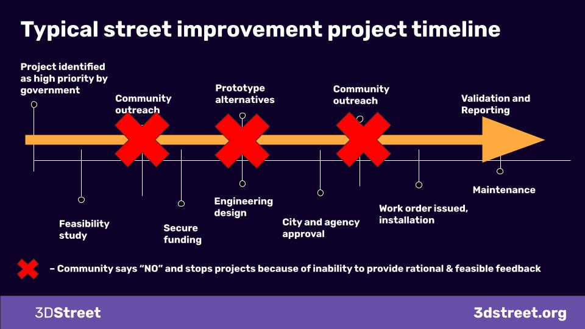

At the recent Caltrans EAC meeting a host of agency professionals, community leaders and technology experts like 3DStreet’s own Kieran Farr shared expertise on the global trend of community-led planning and the current blockers preventing local stakeholders from engaging with local transportation agencies. Below is a summarization of the presentation to share our learnings from practitioners around the world experimenting with community-led design.

<!-- truncate -->
## Community-Led Planning as Global Trend 
Over the past 6 months I've met hundreds of folks across the transportation and planning industry – from city planners and city and state transportation officials to local community activists, NGOs, private engineering consultants and many more.

Hundreds of meetings later, a clear trend has emerged from these conversations: The rising force of "Community-led Planning" – empowering local community members to envision and advocate for changes to their streets and public spaces. However, there are significant challenges preventing this from becoming mainstream practice.

## The Challenge - Negative Trust Spiral
The core issue, as articulated by practitioners worldwide, is that it's very difficult for most people to imagine changes to their streets. This leads to a negative feedback loop:
* Projects face pushback from the community because they don't understand the proposed changes
* This results in delays, watered-down designs, or even outright cancellations
* Trust erodes between the agency and community

**Community engagement is often treated as a point-in-time exercise rather than a continuous process.**

Forward-thinking communities are trying to change this by making community feedback an integral, ongoing part of the planning process. Crucially, project ideas originate from the community itself, which then collaborates with the appropriate agency to refine the design to serve local needs.

## Addressing Agency/Community Asymmetry 
Underlying this dynamic is a major knowledge asymmetry between transportation professionals and the general public when it comes to street design.

To enable meaningful community participation we need to level the playing field – to lift up community members from out of the informational asymmetry crevasse. One way to do this is through a simple, shared visual language to understand the geospatial relationships and design constraints of their streets. This is the key problem we're working to solve at 3DStreet, along with other industry partners [Streetmix.net](https://about.streetmix.net/), [inCitu](https://www.incitu.us/), [StreetPlan.net](https://streetplan.net/), and the [OSM Pedestrian Working Group](https://hackmd.io/legG6QzVREKTsiTSxUS2zA?view).

This emerging ecosystem of no/low cost tools allow anyone to quickly prototype street designs, transforming 2D diagrams into interactive 3D models. Early case studies show the power of this approach:

* [In Manchester, CA, the city engineer used 3DStreet to clearly communicate parking tradeoffs for a Main Street redesign, a top concern for local businesses](https://www.youtube.com/watch?v=ycNIaqczyv0)
* [NGOs like Transport Oakland are training their members to create compelling visuals for advocacy using these tools on group workshop calls](https://studio.youtube.com/video/m393-ZNeU68/edit)
* [At a street fair in San Francisco, we enabled attendees to interactively place street furniture, plantings and amenities using just their smartphones to imagine a green "streets to parks" conversion](//blog/2024/03/25/dev-blog-geospatial-and-augmented-reality-feature-research#reaction-and-productization-1)

Historically, 3D modeling, urban planning and civil engineering required expensive proprietary software. But with the consumerization of augmented reality and open-source tools like 3DStreet combined with widely-deployed WebXR and geospatial standards, these capabilities are now accessible to all. While much work remains to make them truly user-friendly, the potential to revolutionize community engagement is tremendous.

By equipping residents with the tools to express their vision, while educating them about real-world constraints, we can build trust, understanding and consensus between communities and transportation agencies. This is the promise of community-led planning – and it's a future we're excited to build together.

