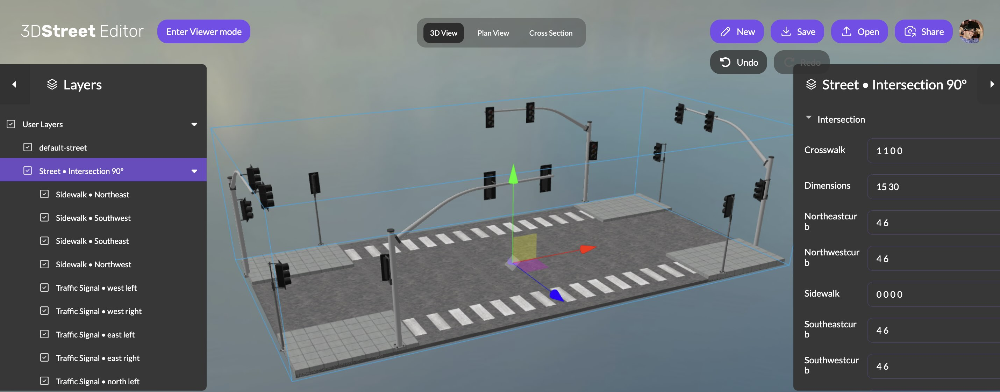
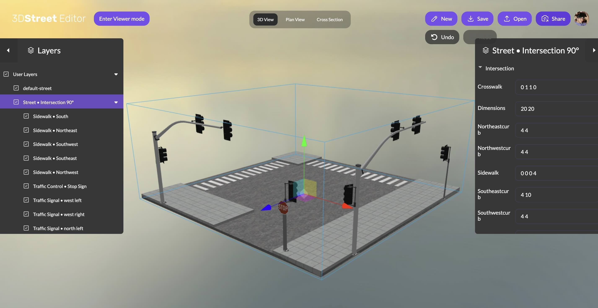

My name is Sam Rothstein and I’m happy to share my work on a new street intersection component for 3DStreet. This is a first version of a highly requested feature and I'm looking forward to seeing what the 3DStreet community can create. 

In this post I'll share how I got involved in 3DStreet, the features of the Intersection component, and what's coming next! 

<!-- truncate -->

I started my career working for [Cesium on CesiumJS](https://cesium.com/platform/cesiumjs/), helping hundreds of developers build bespoke applications around global-scale geospatial data. It was through this open-source 3D work that I met Kieran from 3DStreet and shared his vision of a world where everyone was empowered to reimagine their neighborhood. 

I was inspired to help contribute as an open-source developer and use my background in web-based 3D rendering and full stack engineering to bring the project forward.

Many 3DStreet users have been asking for support for visualizing intersections in their neighborhoods. It turns out, [intersections are hard](https://a-b-street.github.io/docs/tech/map/geometry/index.html )! So we decided to start with something simple: the goal for this initial component was to create a simple yet versatile interface for connecting multiple streets. The component includes options for adding curbs, sidewalks, crosswalks, stop signs, and traffic signals. We made this available in the 3DStreet API for other developers in June 2022, but it wasn’t until now – 2 years later – that the user interface and editor capabilities of 3DStreet have finally caught up to make this available for people to use without writing code.

Here’s a quick overview of the capabilities:

## Create 4-way 90º intersections with custom sizing for each direction

<b><i>A custom intersection example with painted crosswalks along two sides of the long crossing distance, such as a mid-block crosswalk across an arterial where it meets an alleyway.</i></b>

## Customization Features
* Supports optional dead-ends and t-intersections
* Supports optional traffic control devices: traffic signals, stop signs, or none
* Supports optional pedestrian features: crosswalks, sidewalks (for t/dead-end), or none

<b><i>An intersection example using nearly every feature.</i></b>

## Getting Started

We have added step-by-step instructions on how to [add and edit an intersection in our documentation](/docs/development/alpha-labs#adding-and-editing-an-intersection).

## What's next for 3DStreet Intersections?
We call this release Early Access for a reason -- 3DStreet Intersections need more work and we need your help to prioritize what needs improvement. Do we need better geometry? Curb ramps? Better interface to edit the intersection? We'd appreciate ideas and suggestions on how to help you visualize your perfect intersections.

## What’s next for Sam?
I’m honored to be a contributor to the first iteration of a critical component of 3DStreet. Since my 3DStreet contribution, my career has propelled me to new roles including autonomous vehicle data visualization and a new announcement coming soon -- [follow me on LinkedIn for the latest!](https://www.linkedin.com/in/srothst1/) I’m excited to see how people use this component to change the world!

<i>Editors note: Intersections are now available with the 3DStreet Geospatial Pro Plan. Your support will help us continue to improve this component.</i>