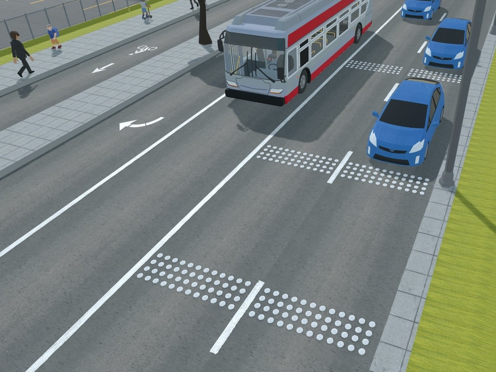
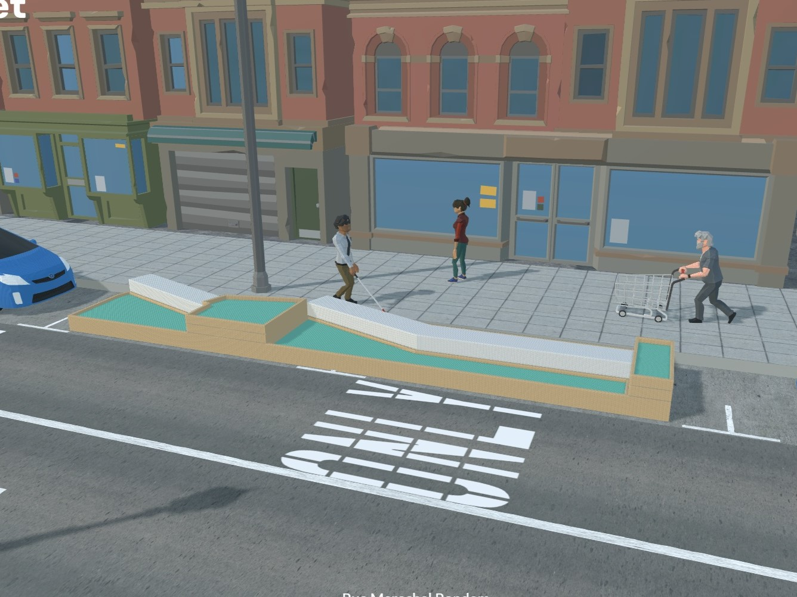
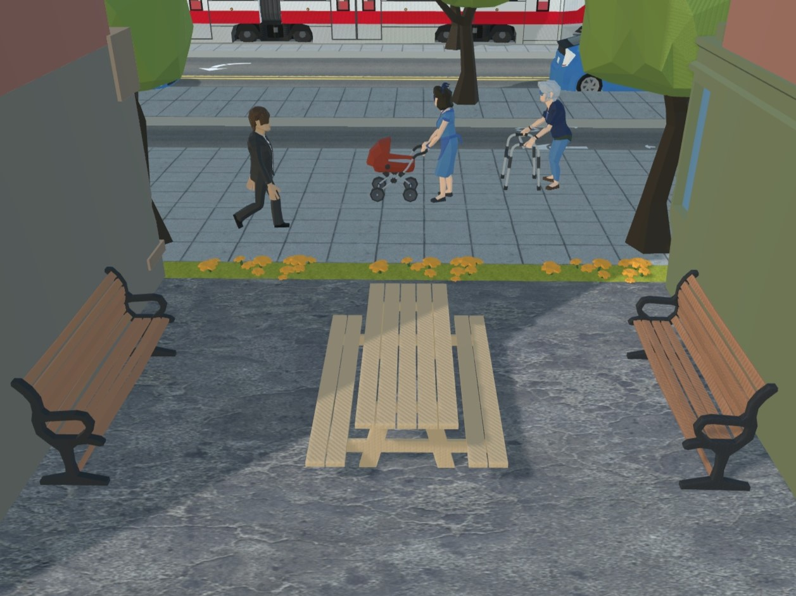
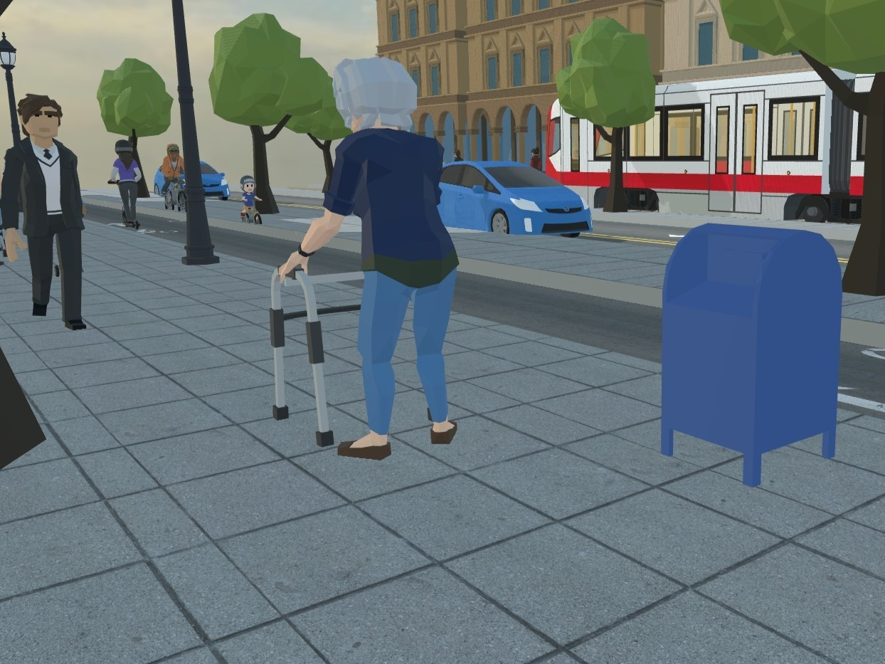
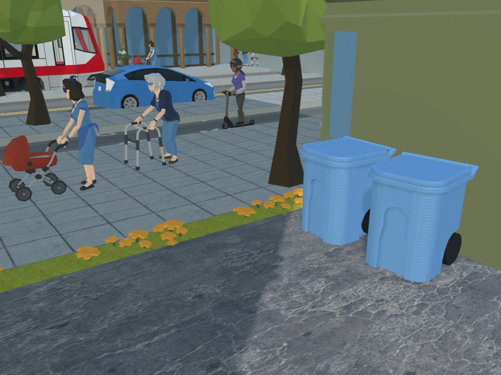
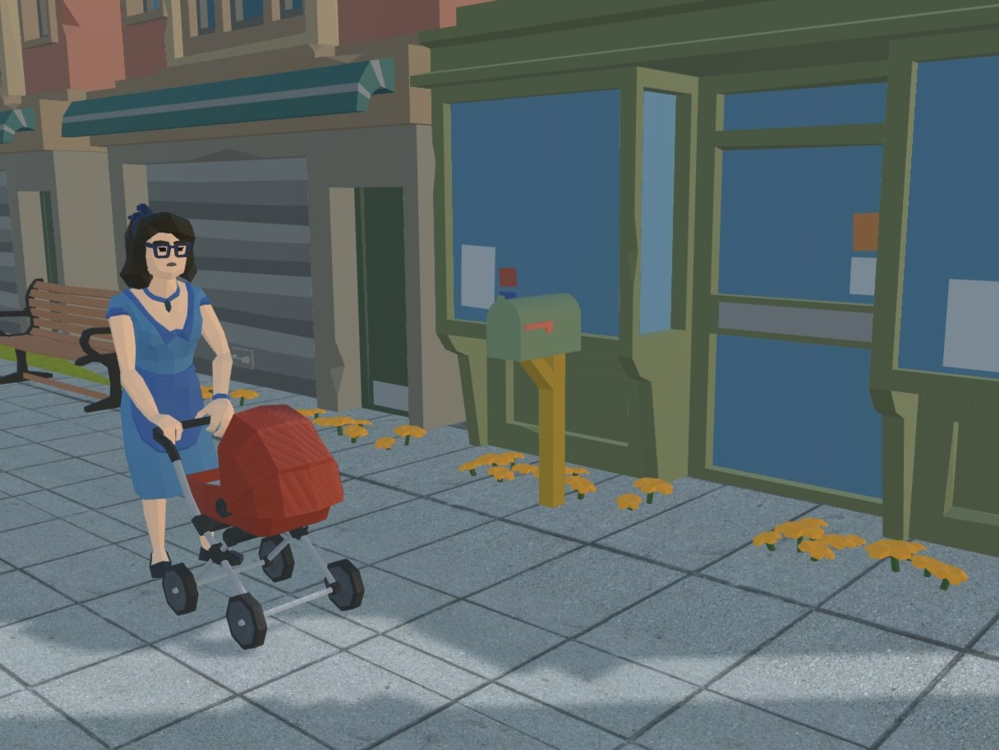

Hi, I’m Tyler Riedell, a fourth-year product design student at the University of Oregon. This past summer, I had the privilege of collaborating with the incredibly talented team at 3DStreet to release several open-source street safety and sidewalk prop models.

<!-- truncate -->

## Introduction
I got involved with this project through my ongoing work with Dr. Marc Schlossberg at the University of Oregon, where I’ve been assisting him in exploring how Augmented Reality can improve street safety in Eugene, Oregon. This experience has given me the opportunity to merge my passion for design with city planning and street safety, topics I never thought I’d be involved in.

This whole experience has been transformative for me, especially in sharpening my 3D modeling skills. As a product designer, I’m used to working with highly detailed models, often with enormous file sizes. But for the models I created to function on mobile AR platforms, I had to rewire how I approached 3D design. When Dr. Schlossberg initially told me to create models with the smallest polycount possible —- without losing their identity —- I was at a bit of a loss on where to begin.

Working with Dr. Schlossberg and team of graphics professionals from 3DStreet like Kieran Farr and GnanaSai Reddy pushed me to expand my knowledge of low-poly model design and the associated pipeline for preparing 3D assets for high performance real-time XR applications -- an area I knew little about before this project. I’m incredibly grateful for the opportunity to collaborate with such experienced individuals, and I’m proud of how much I’ve learned throughout the process.

## Pictures and descriptions of 3D Models

Traffic calming bumps: This object is versatile and low profile, used traffic control, it is effective at alerting drivers of low speed areas ahead

Corner island: This object was created in order to provide safer turns for cyclists in city intersections while still allowing a safe place for pedestrians to stand, it gives bikers full protection from cars throughout the entire bike lane

Parklet: These objects are a great use of space for extra seating around restaurants, parks, and rest areas in cities

Picnic table, USPS Mailbox, Bin, Residential Mailbox: Variations of these objects are common in nearly every city around the world, it seemed necessary to add them to the library of 3DStreet for added realism to city scenes

## Conclusion
Working alongside Dr. Schlossberg, Kieran Farr, and the team at 3DStreet has been an incredible experience, and I’m truly grateful for the opportunity to learn from such talented professionals. As I look ahead, I’m excited to embark on my next adventure in the design world—ideally with a design consultancy in Portland, Oregon—where I hope to collaborate with another group of creative, driven designers and continue growing both personally and professionally.

## Use these traffic safety objects now!
Use these models now to create your own 3DStreet scene by launching the [3DStreet app](https://3dstreet.app/), then click `+` to add a new layer, and find these new models in both the `Sidewalk Props` and `Dividers & Traffic Control` categories.