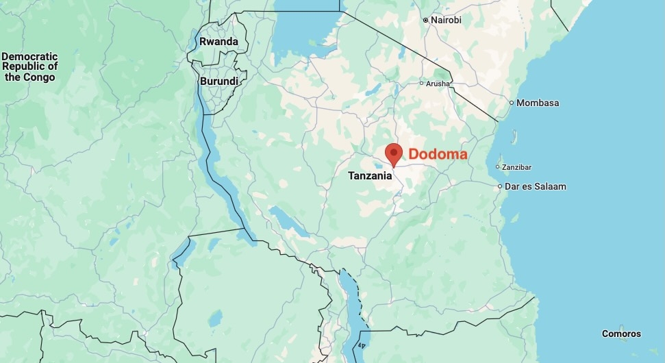

import MuxPlayer from '@mux/mux-player-react';

In Tanzania's rapidly growing capital city of Dodoma, our team used 3DStreet to create digital twins of proposed street safety improvements along critical corridors, helping stakeholders visualize and evaluate sustainable transportation alternatives for this evolving urban center.

<iframe width="100%" style={{"aspect-ratio": "16 / 9"}} src="https://www.youtube.com/embed/Zi1mrf2ufzU?si=ty0lTdGAdhixuV8d" title="YouTube video player" frameborder="0" allow="autoplay;encrypted-media; picture-in-picture; web-share" referrerpolicy="strict-origin-when-cross-origin" allowfullscreen></iframe>

<!-- truncate -->

## A Capital City in Transition

Dodoma, located about 400 kilometers inland from Tanzania's largest coastal city Dar es Salaam, is experiencing unprecedented growth as it embraces its role as the national capital. Formally declared the capital in 1973 and home to the National Parliament since 1995, the city has seen accelerated development since 2016 when the government began actively relocating institutions from Dar es Salaam.

## Growing Pains on Major Corridors

The city's main arteries, particularly the Dodoma-Morogoro Road, currently reflect the growing pains of this urban transformation. The road serves multiple functions as it traverses urban, rural and regional landscapes, requiring careful design consideration to accommodate various user demands while maintaining principles of sustainability and connectivity.

Today, this vital corridor operates as a two-lane arterial road accommodating a diverse mix of traffic:
* Motorcycles and tuk-tuks (bajaji)
* Private cars and vans
* Light and heavy commercial vehicles
* Public transportation buses

While the current infrastructure technically supports both walking and cycling, it predominantly caters to motorized travel - creating challenges for sustainable urban mobility.

<MuxPlayer
    streamType="on-demand"
    playbackId="svF02j01e7kpMEJuHGgHBMXxgT5kP01Bff01"
    primaryColor="#FFFFFF"
    secondaryColor="#000000"
    accentColor="#653CB0"
    autoplay="muted"
    loop
/> 

## From Concept to Digital Twin

Our team worked with key stakeholders including Tanzania National Roads Agency (TANROADS), Tanzania Rural and Urban Roads Agency (TARURA), Land Transport Regulatory Authority (LATRA) and Dodoma City Council (DCC) to explore treatments that would better support regional infrastructure needs.

As analysts entering the workforce, our background in civil engineering was very limited compared to some of our tenured colleagues and professional partners, making it challenging to convert traditional engineering drawings into visualizations that we could then leverage for our work with stakeholders. That's when we discovered 3DStreet, which allowed us to rapidly prototype different scenarios from the foundational engineering work of our professional staff and partners.

Using 3DStreet's prototyping capabilities, we created digital twins of both existing conditions and proposed changes:
* A six-lane dual carriageway with 2 dedicated public transport lanes for busses
* Two-lane service roads on both sides for local access
* Wide, shaded walkways and cycleways for non-motorized transport
* Integration with adjacent land use to support sustainable urban development

<MuxPlayer
    streamType="on-demand"
    playbackId="J9CiVGx3w00021uejA201Fk7O8HwkFsZHmm"
    primaryColor="#FFFFFF"
    secondaryColor="#000000"
    accentColor="#653CB0"
    autoplay="muted"
    loop
/> **The proposed design creates dedicated space for all modes while improving safety and connectivity.**

## Bringing the Vision to Life
We found the ability to instantly transform cross-sections designed in Streetmix to interactive 3D visualizations with satellite map layers in 3DStreet to be transformative to understanding the true impacts and benefits of the proposed project in context with the existing environment.

Also, using a combination of 3DStreet and Mapillary’s street view imagery to create a before and after first-person perspective was particularly impactful - it helped both our team and our local partners understand how the proposed changes would affect the actual experience of using the street. Being able to visualize the separation between modes and the scale of proposed facilities made the benefits much more tangible.

By combining all the elements of 3D GIS data and Street elements from 3DStreet combined with the use of real-world ground truth from Mapillary imagery, we were able to create a very effective video visualization of the project background and potential future scenarios.

<MuxPlayer
    streamType="on-demand"
    playbackId="V6wX5LBeLjY4otX01ILkXyVSmjL6HoqXK"
    primaryColor="#FFFFFF"
    secondaryColor="#000000"
    accentColor="#653CB0"
    autoplay="muted"
    loop
/> 

## Looking Ahead
As our internship draws to a close, we're excited to see Dodoma continue its trajectory of growth aided by our World Bank colleagues investing in Tanzania’s future. We’re proud of the work we’ve done to create digital twin representations of these projects to better engage local stakeholders, and hope that the team is able to leverage our work to envision the future of our country’s sustainable transportation infrastructure. 

## Read More
[Read more information about the project on the World Bank website](https://projects.worldbank.org/en/projects-operations/project-detail/P176623)

*Disclaimer: The views expressed in this blog post do not necessarily reflect the views of the World Bank Group.*