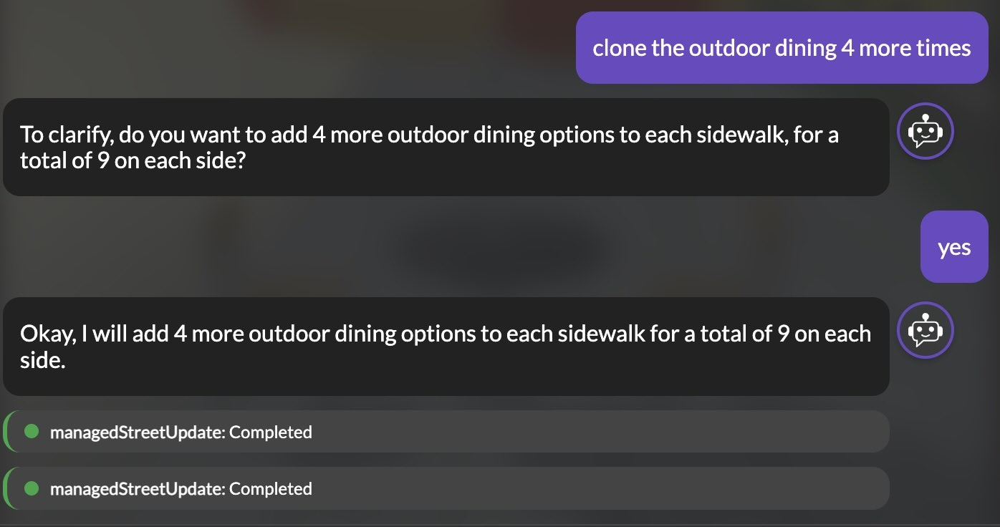

Today we're excited to announce the beta release of the 3DStreet AI Assistant, a new way to create and modify street designs using simple natural language. Just describe the street scene you want to create, and watch as your vision comes to life – no complex 3D editing required.<a href="#the-fine-print-beta-status-and-availability">*</a>
 
 

<!-- truncate -->

## Empowering Everyone to Design Better Streets

At 3DStreet, our mission has always been to provide tools that empower anyone to rapidly prototype visions for improving our shared environment, starting with streets. The introduction of our AI Assistant marks a significant step toward making street design more accessible to everyone – from urban planning professionals to community advocates who may not be familiar with traditional 3D editing tools.
  
 

 
 
With the new AI Assistant, you can:

- **Create complete street scenes** from scratch using natural language descriptions
- **Modify existing designs** by simply explaining what you want to change
- **Automate repetitive tasks** that would normally require multiple manual steps
- **Explore design alternatives** quickly without needing to master complex editing tools

## How It Works

Using the AI Assistant is simple. Just click on the new "Assistant" icon at the bottom of the 3DStreet interface and start describing what you'd like to create or modify. 

For example:

- "Create a two-way street with protected bike lanes and mature trees on both sides"
- "Add a mid-block crosswalk with a pedestrian refuge island"
- "Change the bike lanes to be at sidewalk level with planters as separation"
- "Add outdoor seating areas in front of the cafes on the north side"

The AI Assistant interprets your requests and performs the necessary operations to bring your descriptions to life, handling all the technical details behind the scenes.
 
 

## Why We Built This

We've heard from many users – especially those new to 3D design tools – that while they have clear visions for better streets, translating those ideas into 3D visualizations can be challenging. Creating even simple scenes often requires learning multiple interface elements and performing several discrete actions.

When we analyzed user behavior, we found it difficult to understand user intent through traditional analytics. Is someone moving around the scene because they're confused, happy with what they made, or looking for something specific? It's hard to tell.

By providing a natural language interface, we can:

1. **Break down barriers** to entry for non-technical users
2. **Better understand user needs** through their natural language requests
3. **Provide an alternative UI** for operations that can be challenging or repetitive when using the existing interface

Perhaps most importantly, it allows people to focus on the "what" of their street design rather than the "how" of the software.

## Under the Hood

The 3DStreet AI Assistant is powered by Google's Gemini LLM via its Vertex AI API and our custom React-based chat interface. The most useful part of the Assistant is its ability to call tools that perform actions in the 3DStreet Editor. These tools include entity placement, entity updates, street segment creation and modification, camera control, geospatial location updates and project information memory. When a tool is called, the interface will display a yellow notification while pending and resolve into a green or red notification depending on the result of the function call. You can click the function call notification to see the details of the function call.
 
 

 
 

Building the AI Assistant has helped us improve the underlying 3DStreet codebase. By creating clear function calls for the AI to use, we've had to improve our code structure and interfaces for a number of underlying features, especially street editing through our new [Managed Street Format](/docs/managed-street/overview-managed-street).

## The Fine Print: Beta Status and Availability

### Beta Status
The AI Assistant is currently in beta testing, which means it's still evolving and may occasionally (often?) misinterpret requests or behave unexpectedly. During this early release period, the AI Assistant is available free of charge to all 3DStreet users with some caveats below.

We're actively collecting feedback to improve the experience and would love to hear about your interactions – both successful and challenging! Please share them in our Discord server or other social media (links at the bottom of this page).

### Availability
During this early release period, the AI Assistant is available free of charge to all 3DStreet users, but you must have an account and be signed in. We reserve the right to set daily caps for free users if usage exceeds our budget limits. We reserve the right to log chat conversations to improve the AI Assistant and our street design tools. Access to this feature is subject to the terms of our [Terms of Service](/docs/about-3dstreet/terms-and-conditions).

## What's Next?

We're just getting started with AI integration in 3DStreet. Tell us what you'd like to see as we continue to develop this feature! Some ideas we've had so far include:

- Better guidance for users wishing to create scenes from scratch, such as a Q&A flow for street geometry
- Support for more specialized street design elements
- Better leveraging of existing street data from geospatial sources to assist LLM with street geometry and placement of street elements
- Integration with local LLM APIs for users who prefer to run AI locally
- Expanded automation capabilities for professional workflows

## FAQs

#### Q: Is this a distraction from fixing other features?
A: Improved street geometry editing – especially better intersections support – continues to rank highly on our roadmap. Some users also share frustrations with elements of the 3DStreet user interface, especially new users. Providing simple interfaces for navigating and editing detailed scenes over a large 3D space is challenging. We hope the AI Assistant complements ongoing feature development by making existing features more accessible while we continue to develop more advanced capabilities. And sometimes developing UI for a new spatial feature is harder than developing the underlying code, making the AI Assistant a great option to introduce more experimental features.

#### Q: Is this replacing the current editing interface?  
A: Not at all! The AI Assistant is an additional option that works alongside our traditional editing tools. Power users can continue using the full interface for precise control, while switching to the AI Assistant when it's more convenient.

#### Q: What if the AI Assistant doesn't understand what I want?  
A: The technology is still evolving, and some requests may require clarification. You can always switch back to manual editing if needed. Your feedback helps us improve the system's comprehension over time.

#### Q: Why did you choose the Gemini LLM model?  
A: We've tested a few different models and found [`gemini-2.0-flash`](https://blog.google/technology/google-deepmind/google-gemini-ai-update-december-2024/) to be the most effective for this use-case. We found that Claude 3.7 Sonnet performs similarly, but Gemini has slightly faster response time and access is built-in to our existing GCP / Firebase environment using the Vertex AI in Firebase API. Gemini has also performed very well on large context tasks, and our system prompt combined with scene graph and other user generated elements can drive up context length quickly.

 

 

Between Gemini models, we found that Gemini 1.5 is not "smart enough" so to speak, and Gemini 2.5 is -- too smart? Gemini 2.5 overthinks problems, takes a long time for response, and often returned a worse response than Gemini 2.0. We'll continue to experiment with model changes but have found diminishing returns fiddling with model types as compared to prompt engineering and improving tools invoked via function calling.

## Try It Today

The AI Assistant beta is [available now in the 3DStreet app](https://3dstreet.app). Just look for the "Assistant" icon in the bottom of your screen to get started. We can't wait to see what you create!
