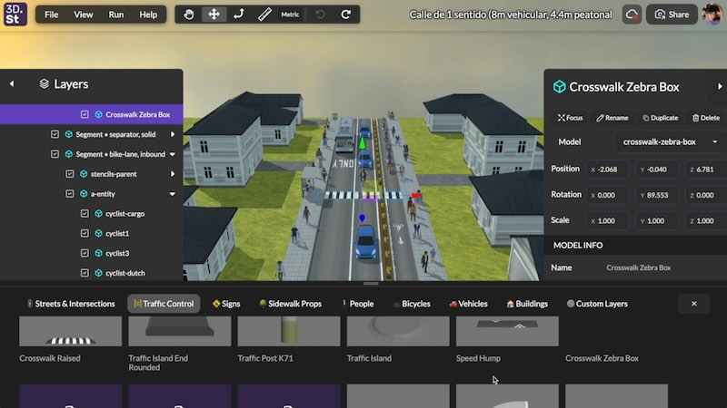
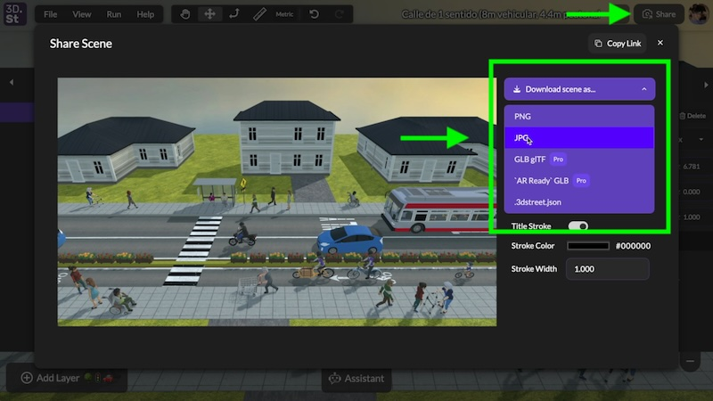
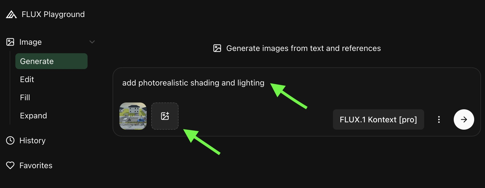
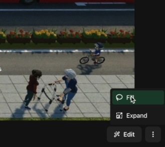
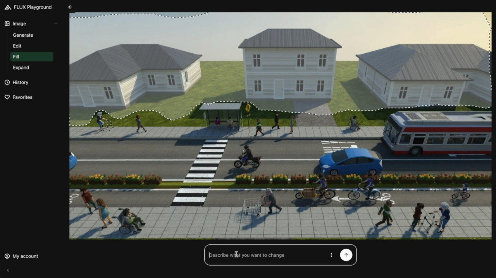
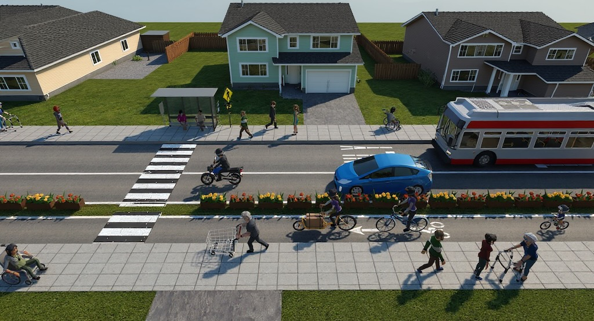
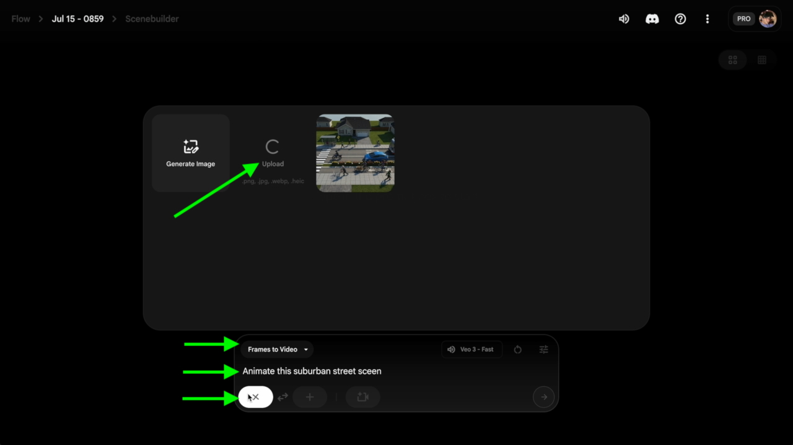
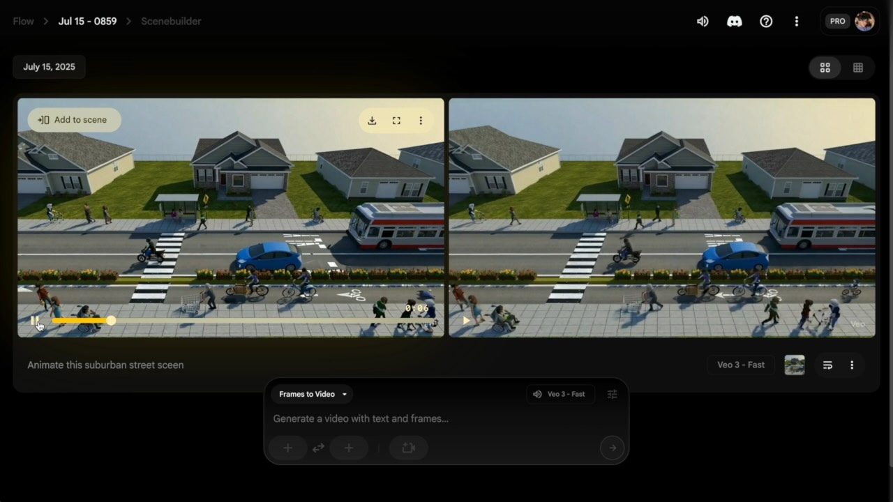

import MuxPlayer from '@mux/mux-player-react';
import { ImgComparisonSlider } from '@img-comparison-slider/react';

# Creating Photorealistic Pictures and Animations with 3DStreet and AI Rendering Tools

Did you know that you can realistic rendering and animations of your street scenes using free or low cost AI tools? Transform your basic 3D street designs into stunning photorealistic images and dynamic animations that will captivate stakeholders and bring your vision to life with this step-by-step guide.
 
 
<MuxPlayer
    streamType="on-demand"
    playbackId="ybdudfr3qeUVZLTS3vx9lPKsoRn7hNWC"
    primaryColor="#FFFFFF"
    secondaryColor="#000000"
    accentColor="#653CB0"
    autoplay="muted"
    loop
/>
 

In this guide, we'll walk through the complete workflow to take a 3DStreet scene from simple 3D rendering to more realistic images and animations using Black Forest Labs (BFL) and Google's Veo3 Models.

<!-- truncate -->

## Step 1: Create Your 3D Street Scene

First, let's create a 3D street scene like normal in 3DStreet. Whether you're starting from scratch or using a user-generated scene, make sure your layout captures the key elements of your street design vision.

Once you're satisfied with your scene composition, it's time to export it for AI enhancement.

## Step 2: Export a Clean JPEG

Download a clean, high-resolution JPEG from your 3DStreet scene using the **share button**. This will serve as the foundation for our AI enhancement process.
 

 

Capture the scene from an angle that best showcases your street design, as this will be the basis for all subsequent enhancements. Make sure to turn off the 3DStreet Logo and the Scene Title (this is a Pro feature) to create a clean export.

## Step 3: Import to Black Forest Labs for Photorealistic Enhancement

Next, we'll import your screenshot into the [Black Forest Labs Playground](https://playground.bfl.ai/) to add photorealistic shading and lighting. This AI-powered tool will transform your basic 3D render into a more realistically shaded image.

Upload your JPEG and for the Flux Kontext [pro] Model to work its magic. You can use a basic prompt like "add photorealistic shading and lighting" or add more details for specific styling changes if desired.

You'll get a couple different example outputs to choose from, each with its own interpretation of how to make your scene more photorealistic.

### Output Before & After Comparison

  
  
</img-comparison-slider>

## Step 4: Use the Fill Tool for Structural Changes

Another powerful feature from Black Forest Labs is the **Fill tool**, which allows you to modify specific parts of your scene. For example, you can change the structure of buildings to have something more realistic looking for suburban single-family homes.

Once you have a source image loaded from a previous enhancement, or directly from 3DStreet, and you're viewing it in full screen from the BFL Playground, click the three-dots in the lower-right-hand corner and then click "Fill".

 
 
In Fill mode, click and drag to create a mask (or outlined area) to indicate the area in which you'd like to replace with new imagery.
 

 
Then, enter a prompt to automatically fill the area with whatever you desire, such as:
- Replacing generic buildings with more realistic architectural styles
- Add detailed facades and realistic building materials
- Modify landscaping and environmental elements
- Enhance street infrastructure with realistic details

In this example we used the prompt, "replace with suburban single family homes":

 
Now we've created a customized, high quality rendering ready for sharing with stakeholders.

## Step 5: Create Animation with Google's Veo

We can take it one step further, by turning this enhanced static image into a dynamic animation! Take your photorealistic screenshot, right-click to download it, and load it into Google's Veo through [Google Labs Flow](https://labs.google/fx/tools/flow/).

Open up the Flow tool, choose "Frames to Video", then upload your enhanced image, then choose that image as the first frame, then enter a prompt such as "Animate this suburban street scene."

 

 
The system will take about a minute to generate your animation options.

## Step 6: Choose Your Animation Style

After processing, Google's Veo will show you a couple different animation options. Each will have its own interpretation of how to bring your street scene to life with:
- Subtle camera movements
- Environmental animations (trees swaying, etc.)
- Lighting changes
- Atmospheric effects

You can choose which ones you like best, or sometimes you'll need to adjust your prompt slightly to get an output that perfectly matches your vision.

## Tips for Success

- **Start with a clear, well-composed 3DStreet scene** - The quality of your final animation depends heavily on your initial composition
- **Experiment with different prompts** - Small changes in your description can yield dramatically different results
- **Be patient with processing times** - AI rendering can take a few minutes, but the results are worth the wait
- **Save multiple versions** - Keep copies of your work at each stage in case you want to try different approaches

## The Results

And there you go! You've successfully transformed a basic 3DStreet scene into a photorealistic, animated visualization that can effectively communicate your street design vision to stakeholders, community members, or anyone who needs to understand your proposed improvements.

This workflow opens up exciting possibilities for urban designers, planners, and advocates who want to create compelling visualizations without needing advanced 3D animation skills.

### Video Tutorial
Here's a video version of this tutorial:
<iframe width="700" height="400" src="https://www.youtube.com/embed/7P1Oq7a0tDM?si=wGMOYa8_W6f_uzv9" title="YouTube video player" frameborder="0" allow="accelerometer; autoplay; clipboard-write; encrypted-media; gyroscope; picture-in-picture; web-share" referrerpolicy="strict-origin-when-cross-origin" allowfullscreen></iframe>