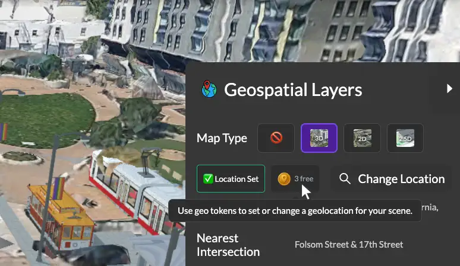

# More for Free: Expanded Access to Geospatial and Intersection Features

We're excited to announce significant improvements to our free tier! Starting today, all 3DStreet users get more access to powerful features that were previously Pro-only, making it easier than ever to create compelling street visualizations.
 
 

<!-- truncate -->

## 3 Free Location Lookups for Everyone

Every 3DStreet user now starts with 3 free location lookups that unlock geospatial capabilities including:

* **Location lookups** - Get street addresses, locality, state, and country information
* **Elevation data** - Access terrain height information for your scenes  
* **Location description** - Create automatic location descriptions including nearby intersections to automatically identify locations of your street projects

These free lookups give you the power to create location-accurate scenes and experiment with geospatial features before deciding if you need the unlimited access that comes with our Pro plan.

<!-- Suggested image: Screenshot showing the location lookup counter in the UI, or a before/after comparison showing a scene with and without geospatial data -->
<!--  -->

## Free Intersection Creation

One of our most requested features - street intersections - is now available for all users! Previously limited to Pro subscribers, you can now:

* Create 4-way 90° intersections with custom sizing for each direction
* Add crosswalks, sidewalks, and traffic control devices  
* Build T-intersections and dead-ends
* Experiment with intersection design without any payment requirements

While this current implementation focuses on 90-degree intersections, it provides a solid foundation for exploring intersection design. As one of our most requested features, we've made it free to give everyone access to experiment with these critical street components while we continue developing more advanced intersection capabilities.

<!-- Suggested image: Example of a 90-degree intersection created in 3DStreet, ideally showing crosswalks and traffic signals -->
<!--  -->

## Simplified Access - No More 30-Day Trial

We've also streamlined our onboarding by removing the 30-day trial requirement. With these new free features available upfront, you only need to provide payment information when you're ready to unlock unlimited geospatial access and advanced Pro features.

This change reflects our commitment to making 3DStreet accessible while giving you the freedom to explore what's possible before making any commitment.

## Try It Out!

Ready to explore these new free features? <a href="https://3dstreet.app/">Click here or the "Launch App" button</a> in the upper-right hand corner of this blog to start creating with your 3 free location lookups and intersection capabilities, or join our Discord community to share what you build and provide feedback on what you'd like to see next.

<!-- Suggested image: A compelling street scene that showcases both geospatial integration and intersections working together -->
<!--  -->

These updates are part of our ongoing mission to democratize street design tools and empower more people to reimagine their neighborhoods. We can't wait to see what you create!