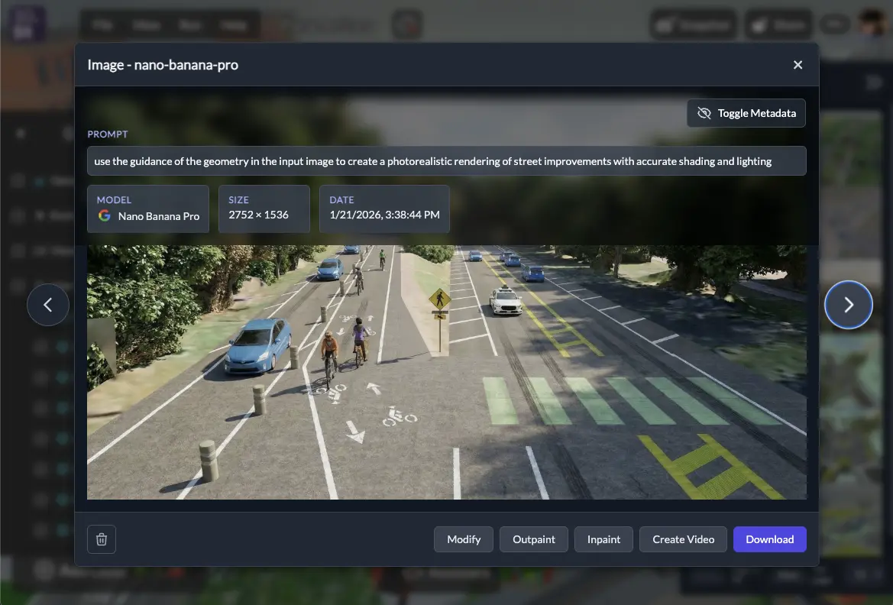
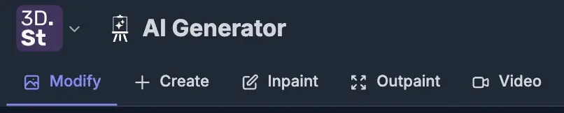

# Product Update: AI Image and Video Generator, Cloud Gallery, and More

It's been a busy few months at 3DStreet! Since our last product update in September 2025, we've shipped a wave of new features focused on expanding our AI creative tools, improving how you manage and share your work, and making it easier to import designs from other platforms. Here's what's new.

<!-- truncate -->

# AI Generator

The new <a href="https://3dstreet.app/generator">AI Generator app</a> is a "generative studio" style interface to access our growing set of AI image and video rendering tools in one streamlined app specialized for urban planning and spatial design. Access AI Generator from the new App Switcher menu by clicking the 3DStreet logo in the upper-left hand corner.

## AI Generator for Video

You can now generate short AI-rendered videos of your street designs in the [Video tab of the AI Generator app](https://3dstreet.app/generator/#video). This brings your scenes to life in a way that static images can't -- imagine showing a stakeholder a flythrough of a proposed protected bike lane or a reimagined neighborhood main street in motion.

Video generation requires a source image to use as the first frame. Upload your own image or open an existing image from your gallery and click "Create Video" to use as an input source. Rendering AI Video assets uses your monthly AI generation tokens, just like image rendering. Quality, rendering time and token usage varies by chosen AI model. 

<iframe style={{aspectRatio: "16/9", width: "100%"}} src="https://www.youtube.com/embed/LE59IH1Qk-A?si=CuenTTjDmscc9E61" title="YouTube video player" frameborder="0" allow="accelerometer; autoplay; clipboard-write; encrypted-media; gyroscope; picture-in-picture; web-share" referrerpolicy="strict-origin-when-cross-origin" allowfullscreen></iframe>

## AI Generator for Images: Modify, Create, Inpaint, and Outpaint

In addition to video, access all our image editing tools in one place with the new <a href="https://3dstreet.app/generator">3DStreet AI Generator app</a>. You can now:

* [**Modify from Input Image**](https://3dstreet.app/generator/#modify) -- Upload your own image or select an image from your gallery as an input, then re-render the image while applying stylistic, editorial, geometrical, rendering, or other modifications using state of the art frontier image models from Google and other major providers. 
* [**Create from Prompt**](https://3dstreet.app/generator/#create) -- Generate a new image from a text prompt without a source image.
* [**Inpaint**](https://3dstreet.app/generator/#inpaint) -- Select a region of an input image from your gallery or uploaded and re-render just that area with a new prompt. Perfect for swapping out details or fixing specific parts of a rendering.
* [**Outpaint**](https://3dstreet.app/generator/#outpaint) -- Extend the boundaries of a generated image beyond the original frame, creating wider panoramic views of your street designs.
* **Edit and iterate** -- Use the gallery to experiment with different styles and prompts on the same scene or input file to learn how they affect the final output

## Cloud Gallery with Cross-Device Sync
All of your rendered images and videos are now stored in your 3DStreet Cloud account, replacing the previous browser-only storage. This means:

* **Cross-device access** - View your gallery from any device where you're signed in including desktop, laptop, and mobile devices
* **Generation metadata** - Each gallery item includes generation details such as model and text prompt used to quickly replicate and modify proven workflows
* **Scene links** - Gallery items generated from 3DStreet Editor now link back to the 3DStreet scene it was generated from for rapid editing

This was a major behind-the-scenes refactor, and it makes the gallery a much more reliable and useful part of the workflow.

<iframe style={{aspectRatio: "16/9", width: "100%"}} src="https://www.youtube.com/embed/Zr_vuhFl13c?si=lpPh48MzFQrqTre1" title="YouTube video player" frameborder="0" allow="accelerometer; autoplay; clipboard-write; encrypted-media; gyroscope; picture-in-picture; web-share" referrerpolicy="strict-origin-when-cross-origin" allowfullscreen></iframe>

## Building Variants on Managed Streets

The street segment sidebar now includes selectable **building variants**, giving you more control over the look and feel of the buildings along your street. Buildings now use a "fit" placement mode instead of random, so the results are more predictable and intentional. Combined with new building assets added to the model catalog, you have a wider palette for creating realistic streetscapes.

<iframe style={{aspectRatio: "16/9", width: "100%"}} src="https://www.youtube.com/embed/ev5MzdFDCZ4?si=VubxbIMPAZ5Cf13x" title="YouTube video player" frameborder="0" allow="accelerometer; autoplay; clipboard-write; encrypted-media; gyroscope; picture-in-picture; web-share" referrerpolicy="strict-origin-when-cross-origin" allowfullscreen></iframe>

New building assets created with support from [StreetPlan](https://streetplan.net/).

## New 3D Assets: Plants and Cars

We've added a collection of new models to the asset library:

* New tree and median planter models
* New car models
* New **Plants** and **Fixtures** categories in the asset panel for easier browsing

<iframe style={{aspectRatio: "16/9", width: "100%"}} src="https://www.youtube.com/embed/KUGcMAux5to?si=yWOxwI13JZW9hhVN" title="YouTube video player" frameborder="0" allow="accelerometer; autoplay; clipboard-write; encrypted-media; gyroscope; picture-in-picture; web-share" referrerpolicy="strict-origin-when-cross-origin" allowfullscreen></iframe>

Also new, now you can see 3D model metadata in 3DStreet for some assets: click to select a built-in 3D model placed in your scene, then use the right-hand properties panel to scroll down Model Info. Assets in 3DStreet have varying origins including original commissioned art, existing assets from sources like Sketchfab, and partnerships.

## Expanded StreetPlan Integration

If you use [StreetPlan.net](https://streetplan.net/) for 2D design and want to visualize your work in 3D, we've made significant improvements to how 3DStreet imports and renders  designs:

* **Expanded object mapping** -- Many more StreetPlan object types now map correctly to 3DStreet equivalents
* **Fixed orientation/side-flipping** -- Elements now render on the correct side of the street
* **Improved lane type support** -- Better handling of different lane types during import
* **Improved vehicle placement** -- Vehicles are now positioned more accurately on street segments
* **Improved building support** -- StreetPlan import now supports more building variants to better match intended styles

Thanks to Mike and the StreetPlan team for their support and help to better connect these systems.

## Drag and Drop 3D Models

You can now drag and drop glTF/GLB files directly into the 3DStreet viewport to import custom 3D models. No need to go through menus -- just drop your file and place it in the scene. This can be handy for quick visualizations, however drag-and-drop models are only available during the initial session and will not be saved when you reload the scene. If you'd like your GLB image to be able to be reloaded in future sessions you'll need to use a third-party storage service. [Here's a quick video showing what you can make with this feature](https://www.youtube.com/watch?v=c9itxUUtQGE).

## Streetmix Schema 33 with Elevation

If you use [Streetmix.net](https://streetmix.net/) for your street cross-section design, 3DStreet now supports import **Streetmix schema version 33** with elevation values in meters which are then converted into a fixed set of curb height levels for 3DStreet.

In the future we should consider using segment height in meters instead of arbitrary curb height levels, but for now Managed Street segments have user-definable curb height levels at increments of 0.15m (approx 6 inches).

## Bollard Buddy: AR Street Safety on Web and iOS

We've launched **Bollard Buddy**, a new AR app for placing street safety objects -- bollards, traffic cones, planters, and more -- on real-world surfaces using your device's camera. It's available in two forms:

* [**Bollard Buddy Web**](https://3dstreet.app/bollardbuddy/) -- Built into the 3DStreet platform as part of our app suite. Access it from the app switcher in the upper-left hand corner to quickly place safety objects in AR and capture photos. This is a demo app with limited functionality using the legacy 8th Wall WebAR SLAM engine.
* **Bollard Buddy iOS** -- A native iOS app built with SwiftUI and RealityKit for a smooth, device-optimized AR experience. Features include tap-to-place objects, drag and rotate gestures, a measurement line tool, and photo capture that saves to your cloud gallery for further image processing and scene editing. (TestFlight beta available for 3DStreet Pro customers.)

<iframe style={{aspectRatio: "16/9", width: "100%"}} src="https://www.youtube.com/embed/uvPY3V4XTMg?si=lpPh48MzFQrqTre1" title="YouTube video player" frameborder="0" allow="accelerometer; autoplay; clipboard-write; encrypted-media; gyroscope; picture-in-picture; web-share" referrerpolicy="strict-origin-when-cross-origin" allowfullscreen></iframe>

Both versions share the same 3DStreet Cloud gallery, so photos you capture in the iOS app show up when you sign in on the web, and vice versa. Bollard Buddy is a fast, focused way to visualize street safety improvements in context -- snap a photo of an unprotected bike lane, drop in some bollards, and share the before-and-after.

## Apple Sign-In

You can now sign in to 3DStreet with your Apple ID, joining our existing Google and Microsoft sign-in options. If you use multiple providers, your profile will show all of your connected accounts. This is part of our work on the new Bollard Buddy iOS App.

## Terrain Flattening for Geospatial Scenes

When working with Google 3D Tiles in a geolocated scene, existing real-world elements like trees, utility poles, and parked cars can get in the way of your design. The new **Terrain Flattening** feature lets you flatten a rectangular area of the 3D map tiles, clearing space so your street design takes center stage.

* Enable flattening from the Geospatial Layers panel and adjust the flattening shape to cover your project area
* Remove distracting map elements like trees, cars, and utility poles that overlap with your design
* Position the flattening shape below ground level to design subterranean treatments like underpasses or sunken plazas

This is especially useful for presentations where you want the focus on your proposed design rather than the existing conditions.

<iframe style={{aspectRatio: "16/9", width: "100%"}} src="https://www.youtube.com/embed/jRxwbcI5R9U?si=lpPh48MzFQrqTre1" title="YouTube video player" frameborder="0" allow="accelerometer; autoplay; clipboard-write; encrypted-media; gyroscope; picture-in-picture; web-share" referrerpolicy="strict-origin-when-cross-origin" allowfullscreen></iframe>

## GeoJSON Import for Building Envelopes

3DStreet already supports 2.5D building geometry from OpenStreetMap, rendering extruded building footprints based on OSM data for any geolocated scene. We've now expanded this with a **general-purpose GeoJSON loader** that can render building envelopes from any GeoJSON source, not just OSM.

This opens up new workflows for importing building envelopes from tools like [Cityscaper](https://github.com/emunsing/cityscaper), a Python-based cityscape forecasting tool that simulates future building development based on zoning scenarios. We recently contributed to Cityscaper to [add GeoJSON export with direct 3DStreet integration](https://github.com/emunsing/cityscaper/commit/6dad4c96733c27883da4b7353e6ee30d98a46d09). Now you can run a zoning simulation, generate a GeoJSON file, and open it directly in 3DStreet from the command line.

<iframe style={{aspectRatio: "16/9", width: "100%"}} src="https://www.youtube.com/embed/ngqPCyUCxxQ?si=lpPh48MzFQrqTre1" title="YouTube video player" frameborder="0" allow="accelerometer; autoplay; clipboard-write; encrypted-media; gyroscope; picture-in-picture; web-share" referrerpolicy="strict-origin-when-cross-origin" allowfullscreen></iframe>

## Gaussian Splat Rendering with Spark

We've updated out Gaussian splat visualization library to use the new [**Spark** 3D Gaussian Splatting renderer for THREE.js](https://github.com/sparkjsdev/spark) improving our support for 3D-scanned environments. If you're working with photogrammetry or 3D capture data, splats now render more efficiently in your scenes.

<iframe style={{aspectRatio: "16/9", width: "100%"}} src="https://www.youtube.com/embed/4DPrFog2uqc?si=lpPh48MzFQrqTre1" title="YouTube video player" frameborder="0" allow="accelerometer; autoplay; clipboard-write; encrypted-media; gyroscope; picture-in-picture; web-share" referrerpolicy="strict-origin-when-cross-origin" allowfullscreen></iframe>

## What's Next

That's a lot of feature talk. To put it all in perspective, we're excited to host a webinar with power user John Boyle from the Greater Philadelphia Bicycle Coalition Thursday February 26 at 1pm Eastern / 10am Pacific.

John will share how he leverages realistic street improvement visualizations to drive change in local communities. [Click here for the registration link](https://riverside.com/webinar/registration/eyJzbHVnIjoia2llcmFuLWZhcnJzLXN0dWRpbyIsImV2ZW50SWQiOiI2OTgzZGYyZjJjNWMwOTYwYzAxNzdmNmQiLCJwcm9qZWN0SWQiOiI2OTgzZGYyZmM0NmQ4MDE1MTRjNTYxZTMifQ==).