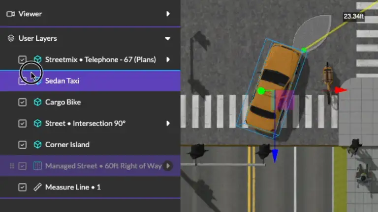
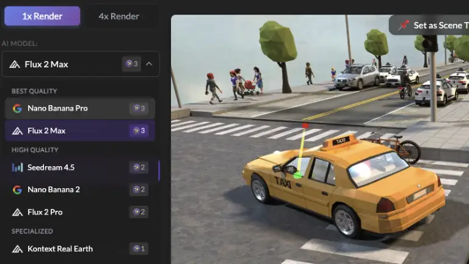
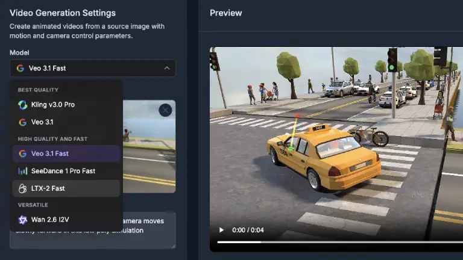

# Product Update: Layer Reordering, AI Model Upgrades, and Faster Loading

Since our last product update in February, we've been focused on one of the most-requested editor features, a major round of AI model upgrades, and a set of performance improvements that make the app noticeably faster to use. Here's what's new.

<!-- truncate -->

## Layer Reordering in the Scene Graph

This has been one of our most-requested features: you can now **drag and drop layers above and below managed streets** in the scene graph panel. Previously, layers were locked in their creation order, which made it difficult to organize complex scenes. Now you can reorder elements freely to match your intended layout, making it much easier to manage scenes with multiple streets, intersections, and standalone objects.

## Next-Generation AI Models

We've upgraded nearly every AI model powering the [3DStreet image and video generators](https://3dstreet.app/generator). If you haven't tried AI rendering in a while, now is a great time -- quality is noticeably better and video generation is dramatically faster.

### Image Models

* **Nano Banana Pro** from Google is now the default image model
* **Seedream** from ByteDance upgraded to 4.5
* Added new **Flux 2 Max** model from Black Forest Labs

### Video Models

* **Veo 3.1 Fast** is now the default video model, generating results in roughly 90 seconds instead of the previous 5+ minutes which caused timeouts for some users
* **Kling 3 Pro** replaces Kling 2.5 for video generation
* **LTX-2 Fast** continues to be a favorite budget option for users

### Variable Pricing and Progress Indicators

We've introduced variable per-model token pricing for image and video rendering. Now you can see exactly what each image and video generation costs before you run it, allowing you to optimize quality, budget or speed.

Estimated progress indicators are now calibrated from three months of real-world API data across nearly 900 predictions, so they are more representative of average wait times, but not an absolute progress indicator.

## Faster App Loading

We've made a significant improvement to how quickly the editor becomes usable after signing in. Previously, the app waited for multiple cloud calls to complete before showing anything. This could take 2-5 seconds or more on slower connections.

Now the editor uses a cached auth state to immediately load while validating and fetching token count in the background. The result is that the editor feels nearly instant on repeat visits.

We've also added a scene loading indicator so you get visual feedback when loading scenes from the cloud, instead of staring at an empty viewport wondering if anything is happening.

## Autosave on Snapshot and Share

Your scene and camera position are now automatically saved when you take a screenshot or share a link. This means the person on the other end always sees your latest changes from the exact camera angle you intended -- no more forgetting to save before sharing.

## Expanded StreetPlan Integration

Thanks An and Mike for contributing more integration upgrades to view [StreetPlan](https://streetplan.net) streets in 3DStreet:

* **Parking vehicles** now render correctly in 3D, including angle parking configurations
* **Gutter segments** have been added to the asset catalog for more accurate curb-to-road transitions
* **Improved street labels and segment names** for better visual mapping between StreetPlan designs and 3DStreet scenes
* **New asset mappings** for multi-story buildings, bikes, rail transit vehicles, and pickup trucks

## Streetmix Elevation Upgrades and Error Fixes in Managed Street (beta)

[Streetmix](https://streetmix.net) recently changed their handling of segment elevation data, switching from integer levels to metric elevation values. This prompted us to clean up elevation across our Managed Street (beta) street segments. 3DStreet Managed Street (beta) uses an integer "level" system (where each level represents 0.15 meters, roughly 6 inches — essentially the height of a standard curb) rather than a specific height value. We've added conversion logic to maintain compatibility with Streetmix's new schema, and this opens the door to more precise segment heights in 3DStreet in the future. We also fixed some elevation calculation bugs that could cause visual artifacts on segment ground surfaces — thank you to users who reported this, it makes our hearts warm to receive bug reports that prove people use this product.

## Improved 3D Gaussian splat Support

For those working with 3D-scanned environments, we've upgraded our Gaussian splat support:

* Upgraded to the official **Spark v2.0.0 preview** library, which enables...
* **Streaming .rad file support** -- splat files can now be loaded via URL parameter, enabling faster loading of large scanned environments

Gaussian splat support is still highly experimental, use with caution or contact us for support.

## Quality of Life

A handful of smaller improvements:

* **Exported `.3dstreet.json` files** now use your scene title as the filename
* **4x AI render** now shows more statuses including an initial "sending" status while the API call is in progress, so you know it's working when using slower connections or high CPU load
* **Menu fade delay removed** for snappier UI interactions
* AI function call tracking for better feedback analysis when you rate AI responses. Many of you are rating the LLM responses, thank you.

## What's Next

We are working on the following milestones in Q2 and Q3, roughly in this order.
1.	Custom Assets (gltf / glb upload)
2.	Camera Controls + Zoom Fixes
3.	Managed Street Parity w/Legacy Streetmix / Retire Legacy Importer
4.	Tutorial
5.	Panel Design Fixes
6.	Map Controls Design Fix
7.	Grouping
8.	Draw on Street

Join our Discord (link below) to share your feedback.