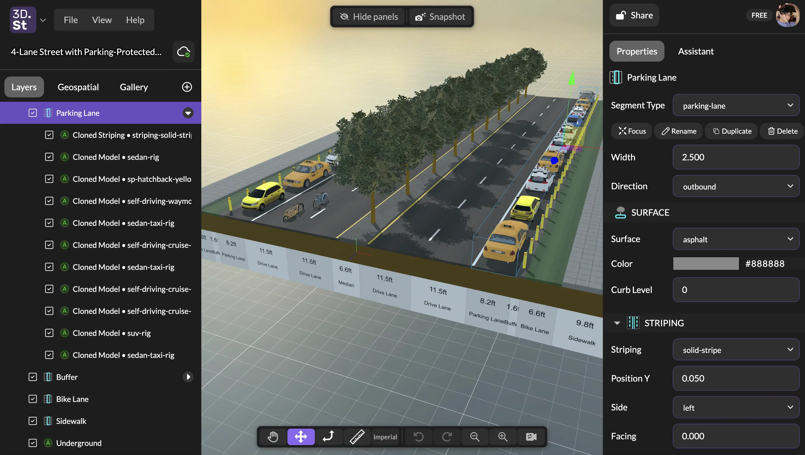

# Product Update: Editor Panel Redesign

We just released one of our biggest changes to 3DStreet's user interface design in a long time -- the 3DStreet editor has a majorly refreshed side-panel layout. This redesign was driven by user research led by **Andrea Maravić** as UX research lead, alongside the broader **University of Cincinnati** team, and design work from product designer **Daria Dombrovska**. We're lucky to have a community of users generous enough to tell us what's working and what isn't, and we want to keep building 3DStreet around what we hear.

<!-- truncate -->

## What the research told us

A recurring theme in the research: the old layout had unclear hierarchy. Tools sat side-by-side regardless of how often people used them, important features (like changing geospatial map settings) were buried deep at the bottom of long panels, whereas precious primary screen real estate was dedicated to the infrequently used AI Assistant features. 

Our application has also evolved over the years. New features such as our Asset Library (Add Layer panel) and our new Gallery (cloud storage for your screenshots, images, and video generations) have become popular features but were "bolted on" to the existing user interface instead of having a thoughtful integration with the rest of the app.

We focused this release rethinking our UI from the ground up based on your feedback.

## New side panels, organized by what you actually do

Upon reloading 3DStreet, you'll immediately notice our biggest change -- a redesigned panel system. Now we have the space for high-priority application features such as Geospatial and Gallery, which previously didn't have a dedicated home. This also allowed us to greatly simplify the Layers panel, removing extraneous layers that confused most users such as Viewer Mode. Panels also now span the full height of the window and is split into tabs:

* **Layers** — the scene graph, with a `+` button at the bottom for adding new layers.
* **Gallery** — your captured and generated images and videos, moved out of the right-side floating panel.
* **Geospatial** — geospatial layers (Google 3D Tiles, OSM, terrain flattening) get their own tab. Research found geolocation was one of the most-used features, so it earned a top-level home instead of a custom row inside the scene graph.

App switcher, scene title, and save status sit at the top. Collapsing the panel keeps the app switcher and title visible so you don't lose your place.

We used the same design styling to renovate our right-hand side-panel with:

* **Properties** — the component inspector for whatever you've selected.
* **Console** — the natural-language assistant (formerly "AI Assistant"), migrated into a sidebar tab instead of a floating window. The Console now also streams a live history of every editor command as pills you can rewind or replay — see the [Console documentation](/docs/key-features/console).

Share, auth, and your plan badge sit at the top.

## Toolbars and a one-key way to hide everything

* A new **primary toolbar** at the top holds the panel-visibility toggle and the snapshot button.
* The **action toolbar** moves to the bottom of the viewport, and the camera reset and zoom controls move into it from the lower-right corner.
* Press **backtick (\`)** to hide both panels for a near-full-viewport view — useful when you're capturing screenshots or presenting in a community meeting.

## What we removed, and what's coming back

To ship this cleanly we pulled three things that caused confusion and / or were infrequently used:

* **Viewer Mode** — research showed it "often went in one direction" and lacked the flexibility users wanted for storytelling. Coming back as part of an upcoming **camera controls milestone** that will also tackle WASD navigation, zoom, and saved camera views — all top requests from the Cincinnati research.
* **AI Assistant Report Generator** — buried, hard to discover, barely used. We can revisit structured outputs as the assistant evolves.

## What's next

The roadmap from the April update hasn't shifted — the panel redesign was item 5 on that list, and we're now turning to the items the research pushed to the top: **camera controls** (with Viewer Mode and saved camera views returning here), **multi-select**, and **grouping / nested layers**. Custom asset upload, a tutorial flow, and managed-street parity with the legacy Streetmix importer are also in the queue.

Thanks again to Andrea Maravić and the University of Cincinnati team, and to Daria — and to everyone who's shared feedback on [Discord](https://discord.gg/VeBPPmFmBP). Keep it coming.