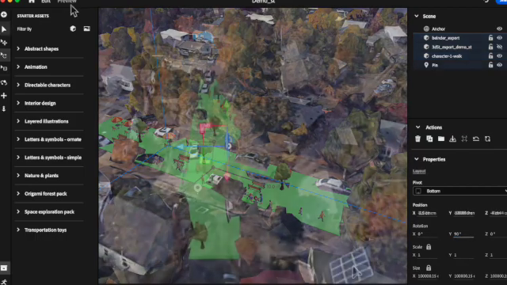

Greetings! I'm Marc Schlossberg, and I've been working alongside Danny Pimentel at the University of Oregon on an exciting project: crafting augmented reality (AR) landscapes for our streets. What I have here is a practical, step-by-step guide designed to walk you through how to bring this innovative vision to your own neighborhood. So, let's roll up our sleeves and get our hands digitally dirty!

<!-- truncate -->
## Getting Started: Measuring and Designing

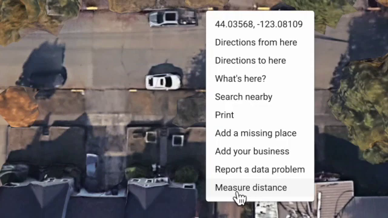**First things first—measure up!**

To kick things off, you need to know how wide your street is. This is more straightforward than it sounds: just pop over to Google Street View or use an aerial photo, and get an approximate measurement. It's okay if it's not pinpoint accurate — we just need a ballpark figure.

**Crafting Your Street: Easy as Pie with Streetmix**

Once you've got your measurements, it's time to jump onto Streetmix—a free, user-friendly online tool that lets you reimagine that street space to your heart's content. Want to add bike lanes, benches, or green spaces? Simply drag and drop the elements you want to include, adjusting the widths to fit your street’s dimensions. Here’s where your creativity shines!

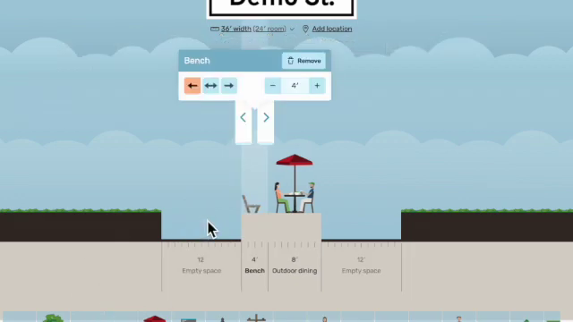For my project, I took a standard residential street and turned it into a car-free park, a delightful haven for community gatherings. Imagine that — but on your block! Feel free to start with the street I made - Demo St.: https://streetmix.net/schlossb/20/demo-st 

## Viewing Your Creation: 3DStreet's Magic

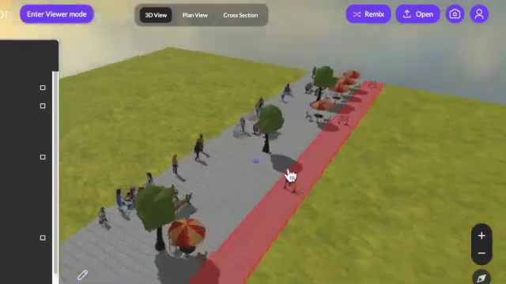

With your design all set in Streetmix, it's time to give it a touch of 3D flair. 3DStreet is a fantastic plugin that lets you visualize your newly designed street in all its three-dimensional glory. Explore your virtual environment, tweak and tune each element until you’re satisfied. It's a mini-adventure in urban planning from the comfort of your screen! You can go straight to my Demo St. in 3DStreet as well: https://3dstreet.app/#https://streetmix.net/schlossb/20/demo-st 

**Trimming the Excess for AR**

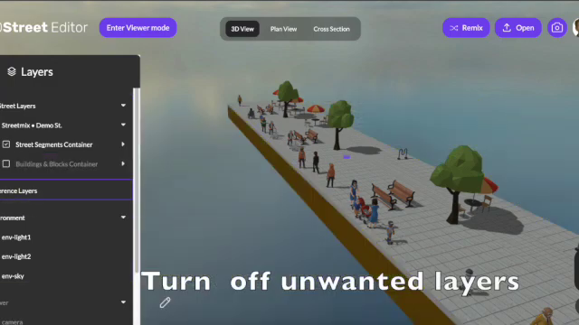

To prep for AR, you'll want to peel away the layers that aren’t needed—like buildings, to keep things neat. After simplifying, you can then export your model directly into a format that's ready for the world of augmented reality.

To delete a layer, select the layer in the left-hand panel -- such as "Buildings & Blocks Container" in the screenshot above -- then press the `delete` key and click `ok`. This will remove buildings and grounds from lots that are not needed for our AR project.

## Optional Tweaks: A Blender Bonus

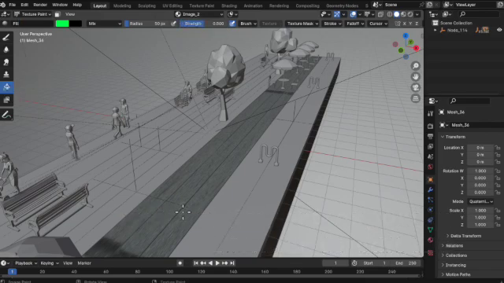For the enthusiasts out there who relish fine-tuning, the free software Blender is your playground. Here, you can manipulate your 3D model to perfection. However, remember this is purely optional—the process is meant to be quick and streamlined.

## Bringing It to Life: Augmented Reality Integration

Alright, now to the magical part—transferring your 3D model to an augmented reality software. I personally use [Adobe Aero](https://www.adobe.com/products/aero.html), thanks to the site license at the university, but there are other AR apps you can explore. This step allows you to add animations and make your scene come alive, although again, this step is not necessary for the "quick and dirty" path.

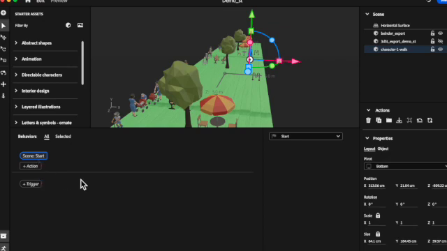

AR software opens with an empty workspace and, at least in Aero, you can simply drag and drop your 3D file onto the workspace and the whole thing magically appears. In many ways it will look exactly like it did in 3DStreet.

**Geolocation: Pinning It to the Real World**

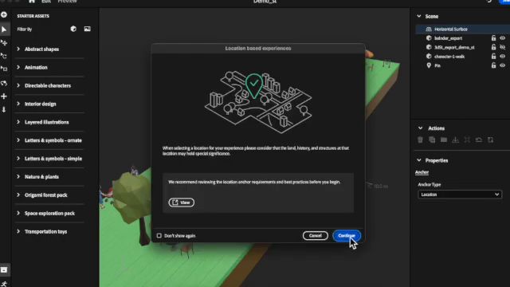What’s truly remarkable with software like Adobe Aero is the ability to anchor your AR scene to a precise location on Earth. While this grounds your creation to a specific spot, it's not mandatory; you can always opt to apply your scene freely to any street you wish.

## Sharing Your Vision: Universal Access

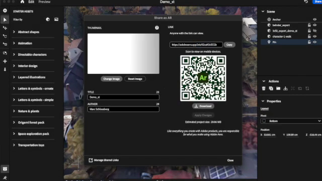

Once your AR scene is polished and ready, you create a shareable link through Adobe Aero. Anyone with this link can open it on their mobile device, head to the designated street, and behold—your digital transformation materializes before their eyes.

> "Your street is transformed into your scene that you can actually walk through and see what it would look like on your street, and you can go forward, backward, see all the different things that you've done, and really start to reimagine, well, what would this street look like if it wasn't a street as has been, but is actually a park, a place for people in this particular example?"

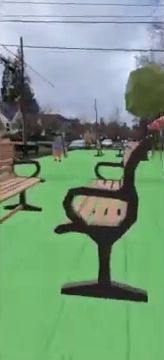

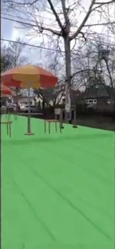

To illustrate, envision wandering through the park that was once just a plain street—all through the magic of AR. Moving forward or backward, the entire scene is interactive and truly a game-changer for community engagement and urban design.

## Wrapping It Up

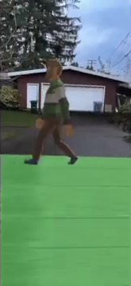

And there you have it—a dynamic overview of transforming streets with AR using some clever tools and a pinch of imagination. Not so intimidating now, right? With mostly free resources and a little bit of time, you can be on your way to designing, exploring, and sharing augmented realities that could pave the way for how we perceive and utilize our shared spaces.

Until next time, happy designing and thanks for joining me on this digital adventure. Bye for now!

# Video version of this post
<iframe width="560" height="315" src="https://www.youtube.com/embed/AP1CwWuD7uA?si=y2_qAYNtR9HpATAl" title="YouTube video player" frameborder="0" allow="accelerometer; autoplay; clipboard-write; encrypted-media; gyroscope; picture-in-picture; web-share" allowfullscreen></iframe>