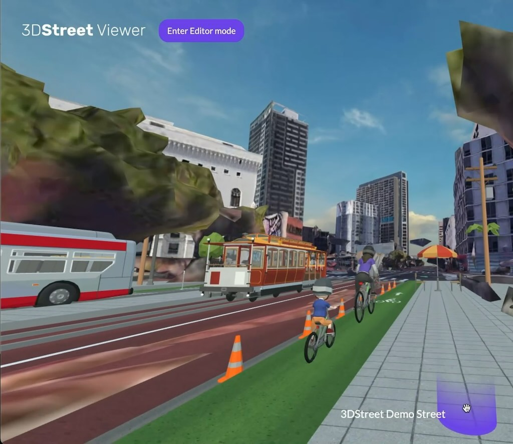
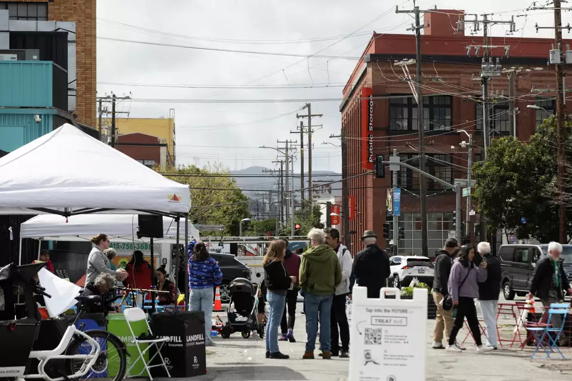

"Geospatial" is the uniting theme for the many feature requests we get from 3DStreet's growing user base. Users can already place custom street scenes, so it's natural to understand why geospatial features like 3D Google Map Tiles or Augmented Reality visualization keep coming up in conversations with users when we [explore common repeatable workflows for visualizing safer infrastructure](/blog/2024-01-30-creating-augmented-reality-ar-scenes-with-streetmix-3dstreet-adobe-aero).

To kick off 2024 we've been doing some experiments to see how these technologies could be applied to public streets and spatial design.

<!-- truncate -->
## Google Maps 3D Tiles

We updated the New York Times R&D team's [GitHub repository for the OGC 3D Tiles A-Frame VR Component](https://github.com/nytimes/aframe-loader-3dtiles-component?tab=readme-ov-file#using-google-3d-tiles-api) to support loading 3D maps from Google Maps 3D Tiles. (Thanks Avner for doing the hard three.js work to make this happen.)

**Proof of concept 3D Tiles and 3DStreet scene combined.**

### Why is this important?

When presenting street improvements projects, leveraging the existing environment provides instantaneous context and understanding for stakeholders of all ages and abilities. Even low fidelity representations of the surrounding environment helps viewers recognize a project's location and orientation.

This experiment is a first step to adding 3D maps as a new feature to 3DStreet Editor.

### Video Demo
This video is a demo of what it could look like to localize your 3DStreet scene with 3D map tiles near Market and Van Ness Streets in San Francisco.

<iframe width="560" height="315" src="https://www.youtube.com/embed/JRWd8P4QwTs?si=lAx7vGRB_rrVIqf6" title="YouTube video player" frameborder="0" allow="accelerometer; autoplay; clipboard-write; encrypted-media; gyroscope; picture-in-picture; web-share" referrerpolicy="strict-origin-when-cross-origin" allowfullscreen></iframe>

### Reaction and productization

This demo resonated well with users -- [our first tweet sharing the concept](https://twitter.com/3dstreetapp/status/1768310079307272423) was retweeted 11 times and liked more than 50 times on Twitter and [attracted engaging comments on LinkedIn](https://www.linkedin.com/posts/3dstreet_threejs-activity-7174079008819560449-kzqw).

Users would like 3D Map Tiles productized as a built-in feature of 3DStreet, but unfortunately the Google 3D Tiles API is significantly more expensive than traditional 2D map tiles starting at [$6 per 1000 unique user sessions](https://github.com/nytimes/aframe-loader-3dtiles-component?tab=readme-ov-file#using-google-3d-tiles-api). In order to offer this feature we will need to come up with a paid subscription plan option to cover the costs of Google Maps 3D Tiles access.

## Bollard Buddy AR - mobile app for manual geolocation and object placement
The recent [DreamXR hackathon](https://dreamxr.co/) in San Francisco was the perfect environment to work alongside other XR developers for inspiration to finish a new app in 48 hours. We created BOLLARD BUDDY AR -- an app that lets you place traffic control devices anywhere using augmented reality!

### Video Demo
It's easiest to show with a video:

<iframe width="315" height="560" src="https://www.youtube.com/embed/mP32oAlz8iI" title="Bollard Buddy AR - 2024 DreamXR Hackathon Demo" frameborder="0" allow="autoplay; encrypted-media;picture-in-picture; web-share" allowfullscreen></iframe>

The app is simple:
* Press PLAY to start the AR view after scanning a QR code*
* Then tap to place cones or other objects at the yellow cursor.
* Choose between a few different traffic safety device models from the 3DStreet model library

While cool, it is technically "table stakes" within the scope of AR app demos. But what's next makes it more useful.

### Geospatial QR hack for fake VPS
What makes BOLLARD BUDDY AR app unique compared to other AR "tap to place" demos is the connection to a specific location -- a longitude and latitude is embedded in the app QR code so that any objects placed in the scene can be localized relative to that longitude and latitude origin point.

This is extremely effective as a cheap and easy way to have a perfect "virtual positioning system" (or VPS) as long as the person posting the sign is capable of posting the sign at the very specific longitude and latitude (and orientation) associated with the QR code. This is easier than it sounds -- by simply dropping a pin on Apple or Google Maps at a clearly identifiable landmark such as a parking meter or telephone pole at a sufficient zoom level you can get a very precise longitude and latitude.

### Create and share from mobile -- serverless with no auth
The other unique BOLLARD BUDDY AR feature is sharing your newly created augmented reality street scene with other users (and even yourself) to refer to in the future.

Outside in the bright sun on the hot tarmac we don't want to challenge users with authentication or collecting data that requires keyboard input. How can we allow people to share a complicated geospatial scene without a server or authentication?

Our trick was to stuff the newly created scene data in the URL as url-encoded data. More specifically, a JSON representation of the array of 3D A-Frame entities and for each their mixin, position, rotation properties are all [crushed](https://github.com/KilledByAPixel/JSONCrush) and placed as a querystring value in a new "Share URL".

Then we use the native OS share dialog to allow the user to choose how they want to share this, from copy/paste to sending message, email, AirDrop (my favorite) or more.

### Challenges with web-based Augmented Reality

I've always been excited about the fun factor of AR and VR headsets, but recent technology advances in everyday smart phones means that the same tech is possible without a headset leveraging built-in AR libraries such as ARKit and ARCore on Apple and Android devices respectively.

The magic of these AR libraries is precision -- they have extremely accurate [simultaneous localization and mapping (SLAM)](https://en.wikipedia.org/wiki/Simultaneous_localization_and_mapping) available out-of-the-box for native apps usable on almost any device you may have in your pocket.

Until now these libraries have only been available for native applications, but recently web JavaScript-based access was made available on Android through WebXR AR Mode bindings. iOS devices using Safari have not yet supported WebXR AR Mode, however recently there have been a few "polyfill" workarounds. We are using [Variant Launch](https://launch.variant3d.com/) which provides a (nearly) seamless experience for iOS users to instantly launch web-based AR apps. Behind the scenes, Variant Launch uses Apple's iOS "App Clips" feature to the underlying ARKit library through the WebXR JavaScript standard without needing to download an app first.

### Reaction and productization

People often show surprise when using the app for the first time -- perhaps from the fun of reconfiguring public space for the first time, or the magic of discovering a super power they didn't realize their smart phone supported.

Some users see past the initial "Wow Moment" to practical use cases, especially for professional field measurement and planning for traffic control device placement or other civil engineering-related purpose. In fact, once users start placing basic cones provided in the default application it's not long before they start thinking of other objects they'd like to place and additional use cases.

We've continued development of this app concept, most recently adding new objects and improving usability and trying it out with real users at a street fair in San Francisco Saturday March 23.

**Picture of a street fair with QR code on signage to collect feedback from community members using a modified version of BOLLARD BUDDY AR with plants, flowers and other street greening objects. [Credit Benjamin Fanjoy/The Chronicle](https://www.sfchronicle.com/bayarea/article/treat-avenue-green-space-19362364.php)**

Similar to other geospatial features, there are fees incurred to make AR placement apps available across all devices (especially including iOS).

## Feedback and next steps
I'd love to hear your feedback on this work at [kieran@3dstreet.org](mailto:kieran@3dstreet.org). Would you like these features? What is a price that you would pay for a subscription plan that includes these features?