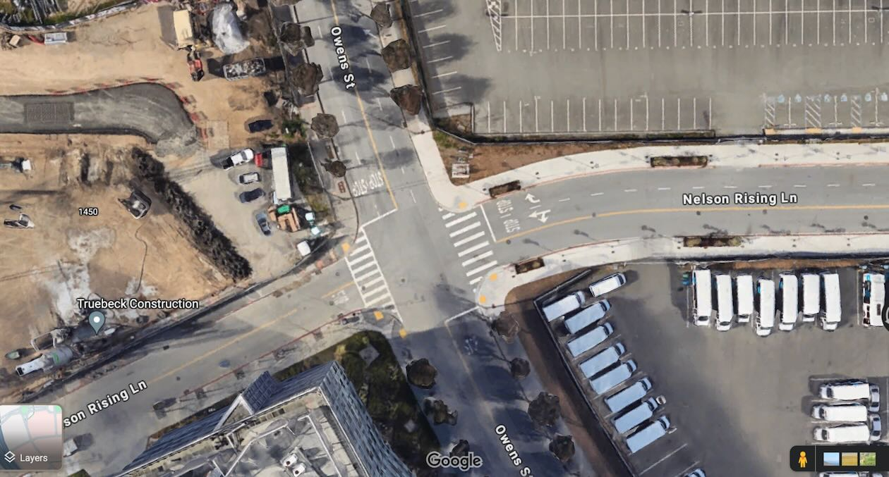

In San Francisco's Mission Bay neighborhood, community leaders used 3DStreet's rapid prototyping service to create a 3D digital twin of proposed street safety improvements around a new elementary school, helping them effectively advocate for the project with city officials and stakeholders.

## New Neighborhood, No School

San Francisco’s Mission Bay neighborhood is one of the fastest growing areas in the City. From 2010-2020 it doubled its population thanks to hosting many of SF’s new residential building projects – some of which were even 100% affordable. [1] [2] Mission Bay is also host to the world’s most advanced technology organizations like OpenAI, Uber, UCSF, and countless others, not to mention world-class entertainment facilities like the newly built Chase Center, home of the Golden State Warriors.

But there’s one glaring omission in Mission Bay – there are no schools. “There currently are no elementary, middle or high schools, public or private, in the Mission Bay area,” said Matt Haney in 2017, then President of the Board for SF public schools. “This is unacceptable. This is a community that urgently deserves and needs a school.” [3]

 
The future site for an elementary school building in Mission Bay, San Francisco is currently a parking lot sitting on top of rocky fill covering what was once part of an actual bay and tidal wetlands. [9]

<!-- truncate -->
25 years after being proposed in a 1998 Mission Bay redevelopment plan, construction on a school in the neighborhood has finally begun! The $90 million Mission Bay Elementary School project is expected to be completed in time to open for the school year starting August 2025. [5]

## New Neighborhood, Old School Transportation

Despite its recent development, SF Mission Bay was designed with no protected active transportation facilities aside from bayside trails. Many of its streets consist of 3 lanes dedicated to motor vehicles in each direction (2 travel, 1 parking) with no separated mobility facilities, few painted facilities, and copious sharrows. While effective to accommodate peak egress vehicle traffic after Warriors and Giants ball games, existing street space does not promote active mobility for neighborhood residents and school children.

 
 Owens Street meets Nelson Rising Lanes in Mission Bay, San Francisco. The parcel northeast of the intersection (currently occupied by a parking lot) is the future site of the proposed SFUSD Mission Bay Elementary School.

However, community leaders were disappointed with the limited nature of City resources dedicated to improving street safety conditions ahead of construction of the new school. While the City committed to fund a study [7] to identify problem areas and suggest possible designs for a few specific areas, it fell short of community expectations to deliver a comprehensive site-wide plan for complete streets access to the school.

The community took it upon themselves to create their own designs. “We started by rethinking the traffic circle neighboring the new school originally designed to accommodate peak vehicle flows after ball games. Instead, we wanted to imagine a world where we use street space for fully separated modes, providing a safety buffer for vulnerable road users while also reconnecting active mobility to nature and planned affordable housing,” explained Nik Kaestner, a former Director of Sustainability at SFUSD.

 
A hand-drawn sketch by Nik Kaestner to illustrate core concepts of a proposed project to add separated cycling facilities to an existing traffic circle at the intersection of Mission Bay Drive and Owens St.

## From Idea to Prototype with 3DStreet Rapid Prototyping Service

“We were inspired by complete streets ‘Dutch style’ roundabouts [8] with full separation continuing through the intersections, not only along approaching streets,” continued Kaestner. “But we were limited in our ability to convert our vision from hand-drawn sketches into a practical prototype that would be taken seriously by professional City staff and excite fellow advocates.”

Community leaders with the Dogpatch Neighborhood Association turned to 3DStreet for help converting these ideas and sketches into a 3D prototype to create visuals and diagrams in advocacy and planning conversations with City staff and elected officials.

This simplified “digital twin” encompasses a virtual representation of both the existing conditions and proposed future changes. Hosting on 3DStreet Cloud allowed the team to create visuals for specific use-cases on demand and share these with others to further remix.

 
Caption Needed

## Adding Context with Real World Elements

To provide visual context for stakeholders reviewing proposed changes, community leaders added real-world surface scan maps and a 3D model of the proposed elementary school using 3DStreet’s Geospatial Pro features.

Leveraging multiple camera perspectives, especially simulating a first-person view, was especially helpful to share critical design attributes with stakeholders.

“The multi viewpoint visualization, especially the first-person view animation of traffic circle usage at a child’s height, provided excellent supporting material to get the attention of elected officials and city staff. Our key asks were clearly conveyed in the context of the overall project.” said Bruce Agid, a local community member advocating on behalf of neighboring residents.

## Is it Feasible? From 3D Prototypes to Civil Drawings

This project is just starting. The school has broken ground with more than a year of construction remaining. While the prototypes of safer school streets are winning people’s hearts, the constraints of budget and technical feasibility are the next issues to tackle for community and City stakeholders.

Luckily, 3DStreet gives stakeholders a head start as they consider more detailed civil plans. “3DStreet’s ability to export the community prototypes into a vector format compatible with AutoCAD allowed us to automate the manual process of preparing baseline conditions so that our valuable engineer time can be better spent on project-specific requirements,” said Jorge Romero-Lazano, a civil engineer with GreeningProjects.org who consulted on the project.

### References

[1] https://www.potreroview.net/mission-bays-population-almost-doubled-in-last-decade/ 

[2] https://www.sf.gov/news/city-celebrates-opening-and-dedication-affordable-housing-mission-bay 

[3] https://www.potreroview.net/new-mission-bay-public-school-to-be-launched-within-five-years/ 

[4] https://www.sfusd.edu/about-sfusd/sfusd-news/press-releases/2022-10-27-construction-set-begin-new-sfusd-school-mission-bay 

[5] https://sfyimby.com/2023/02/sitework-underway-for-mission-bay-school-in-san-francisco.html 

[6] The SFCTA is a SF County agency, separate from the SF Municipal Transportation Agency. https://en.wikipedia.
org/wiki/San_Francisco_County_Transportation_Authority [9] https://www.foundsf.org/index.php?
title=Filling_The_Bay_Along_San_Francisco%E2%80%99s_Southern_Waterfront 

[7] https://www.sfcta.org/mission-bay-school 

[8] https://bicycledutch.wordpress.com/2015/10/13/explaining-the-dutch-roundabout-abroad/ 