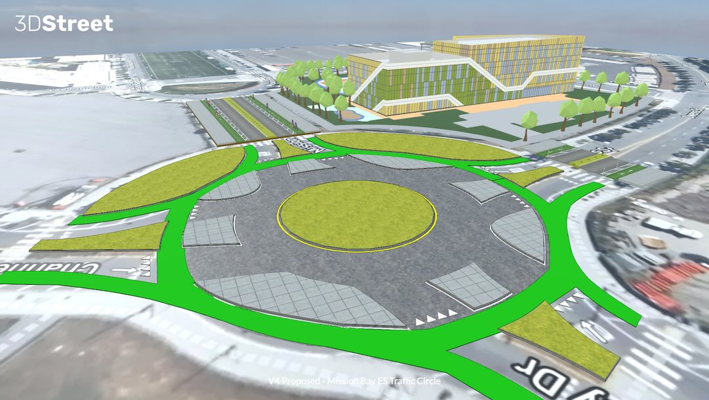

import MuxPlayer from '@mux/mux-player-react';
import { ImgComparisonSlider } from '@img-comparison-slider/react';

In San Francisco's Mission Bay neighborhood, community leaders used 3DStreet's rapid prototyping service to create a 3D digital twin of proposed street safety improvements around a new elementary school, helping them effectively advocate for the project with city officials and stakeholders.

        
          
          
        </img-comparison-slider>

<!-- truncate -->

## New Neighborhood, No School

San Francisco’s Mission Bay neighborhood is one of the fastest growing areas in the City. From 2010-2020, it doubled its population by hosting many of SF’s new residential building projects. [1] [2] Mission Bay is also host to well-known firms like OpenAI, Uber, and UCSF, not to mention world-class entertainment facilities like the newly built Chase Center, home of the Golden State Warriors.

But there’s one glaring omission in Mission Bay – there are no schools. “There currently are no elementary, middle, or high schools, public or private, in the Mission Bay area,” said Matt Haney in 2017, then President of the Board for SF public schools. “This is unacceptable. This is a community that urgently deserves and needs a school.” [3]

 <i>
The future site for an elementary school building in Mission Bay, San Francisco is currently a parking lot sitting on top of rocky fill covering what was once part of an actual bay and tidal wetlands. [4]</i>

25 years after being proposed in a 1998 Mission Bay redevelopment plan, construction on a school in the neighborhood has finally begun! The $90 million Mission Bay Elementary School project is expected to be completed in time to open for the school year starting August 2025. [5]

## New Neighborhood, Old School Transportation

Despite its recent development, Mission Bay was designed with no protected active transportation facilities aside from bayside trails. Many of its streets consist of 3 lanes dedicated to motor vehicles in each direction (2 travel, 1 parking) with no separated bike lanes, few painted ones, and copious sharrows. While effective in accommodating egress vehicle traffic after Warriors and Giants games, existing street space does not promote active mobility for neighborhood residents and school children.

 
<i>Owens Street meets Nelson Rising Lanes in Mission Bay, San Francisco. The parcel northeast of the intersection (currently occupied by a parking lot) is the future site of the proposed SFUSD Mission Bay Elementary School.</i>

Local community members are excited about the prospect of improving street conditions to encourage active walking, biking and mobility for students living in the neighborhood.

“Mission Bay is a densely populated, flat neighborhood, so it just makes sense to provide active mobility options for students going to school. But we are faced with a built environment that prioritizes the car and makes walking and cycling a scary proposition for parents,” said Peter Belden, a community activist and San Francisco’s 2024 Bike Champion of the Year.

## Community Groups Envision a Better Future Change

However, community leaders were disappointed with the limited resources dedicated to improving street safety ahead of construction of the new school. While the City committed to fund a study [6] to identify problem areas and suggest possible designs for a few trouble spots, it fell short of community expectations by not delivering a comprehensive, neighborhood-wide plan for safe walking and biking access to the school.

The community took it upon themselves to create their own designs. “We started by rethinking the traffic circle neighboring the new school and originally designed to accommodate peak vehicle flows after ball games. With a school going in next door, we wanted to re-imagine it as best-in-class infrastructure that separates modes, providing a safety buffer for vulnerable road users while allowing residents to access nature and planned affordable housing without the need for a car,” explained Nik Kaestner, the former Director of Sustainability at SFUSD.

 
A hand-drawn sketch by Nik Kaestner to illustrate core concepts of a proposed project to add separated cycling facilities to an existing traffic circle at the intersection of Mission Bay Drive and Owens St.

## From Idea to Prototype with 3DStreet Rapid Prototyping Service

“We were inspired by ‘Dutch-style’ roundabouts [7] with full separation continuing through the intersection, not only along approaching streets,” continued Kaestner. “But we were limited in our ability to convert our vision from hand-drawn sketches into a practical prototype that would excite fellow advocates and be taken seriously by City staff.”

<MuxPlayer
    streamType="on-demand"
    playbackId="wH4aMaxcBzafPSFA5a9n02YPLKy2GLzAD"
    primaryColor="#FFFFFF"
    secondaryColor="#000000"
    accentColor="#653CB0"
    autoplay="muted"
    loop
/> 
<i>Animation generated by 3DStreet showing the evolution from existing conditions of a mixed-mode traffic circle to a mode-separated traffic circle.</i>

Community leaders turned to 3DStreet for help in converting the sketch into a 3D prototype that can be used  in advocacy and planning conversations with City staff and elected officials.

This simplified “digital twin” encompasses a virtual representation of both the existing conditions and proposed future changes. Hosting on 3DStreet Cloud allowed the team to create visuals for specific use-cases on demand and share these with others to further remix.

## Adding Context with Real World Elements

To provide visual context for stakeholders reviewing proposed changes, community leaders added real-world surface scan maps and a 3D model of the proposed elementary school using 3DStreet’s Geospatial Pro features.

 
<i>Adding the Mapbox satellite map ground layer along with a low fidelity 3D model of the school building helped ground the visualization in the present-day context.</i>

Leveraging multiple camera perspectives, especially simulating a first-person view, was especially helpful to share critical design attributes with stakeholders.

“As our neighborhood develops a vision for how we will welcome the Mission Bay school, this tool is a great gift to outreach and engagement with both elected officials and agency staff.The multi viewpoint visualization, especially the first-person animation of traffic circle usage at a child’s height and the before/after slider bar feature clearly convey what is possible.” said Sarah Bertram, a local community member advocating on behalf of neighboring residents.

<MuxPlayer
    streamType="on-demand"
    playbackId="GJ8AFx2PIwn9y5f2B016EVKXYkzmj6lxT"
    primaryColor="#FFFFFF"
    secondaryColor="#000000"
    accentColor="#653CB0"
    autoplay="muted"
    loop
/> 
<i>Animation generated by 3DStreet showing the first-person animation of traffic circle usage at a child's height.</i>

## Is it Feasible? From 3D Prototypes to Civil Drawings

This project is just starting. The school has broken ground with more than a year of construction remaining. While the prototypes of safer school streets are winning people’s hearts, the constraints of budget and technical feasibility are the next issues to tackle for community and City stakeholders.

Fortunately, 3DStreet gives stakeholders a head start as they consider more detailed civil plans. “3DStreet’s ability to export to other popular file formats allowed us to jumpstart the manual process of preparing baseline conditions so that our valuable engineer time can be better spent on project-specific requirements,” said Jorge Romero-Lozano, a civil engineer and executive director of GreeningProjects.org, who also consulted on the project.

## Make Your Next Community-Led Project a Success

Let us help you with your next community-led improvement project. Our team is available to provide assistance as you navigate the community-led development process, from ideation to prototyping, stakeholder communication, and community outreach empowered by next generation technology. [Learn more about our Rapid Prototype Service to quickly move your project to the next stage.](/docs/services/)

### References

[1] https://www.potreroview.net/mission-bays-population-almost-doubled-in-last-decade/ 

[2] https://www.sf.gov/news/city-celebrates-opening-and-dedication-affordable-housing-mission-bay 

[3] https://www.potreroview.net/new-mission-bay-public-school-to-be-launched-within-five-years/ 

[4] https://www.foundsf.org/index.php?title=Filling_The_Bay_Along_San_Francisco%E2%80%99s_Southern_Waterfront 

[4] https://www.sfusd.edu/about-sfusd/sfusd-news/press-releases/2022-10-27-construction-set-begin-new-sfusd-school-mission-bay 

[5] https://sfyimby.com/2023/02/sitework-underway-for-mission-bay-school-in-san-francisco.html 

[6] https://www.sfcta.org/mission-bay-school Plan provided by the SFCTA, a SF County agency which is separate from the SF Municipal Transportation Agency. https://en.wikipedia.org/wiki/San_Francisco_County_Transportation_Authority 

[7] https://bicycledutch.wordpress.com/2015/10/13/explaining-the-dutch-roundabout-abroad/ 

