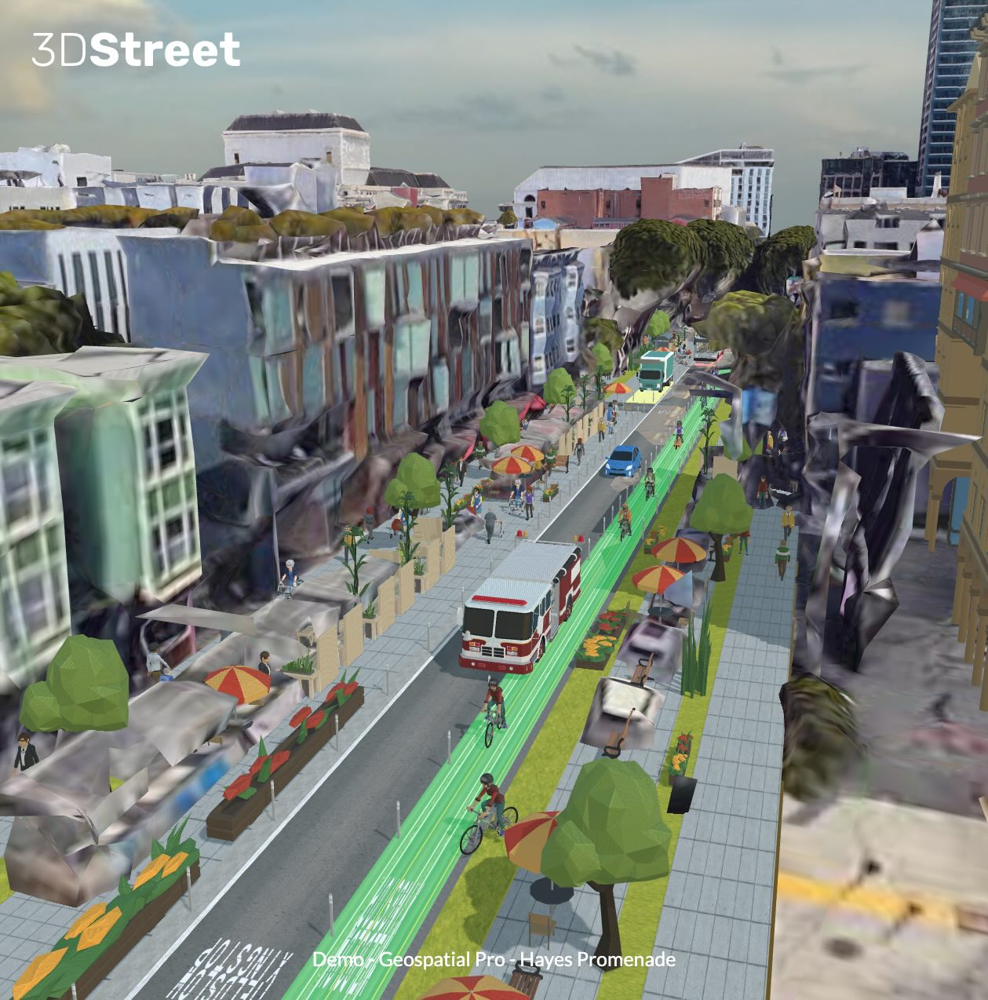
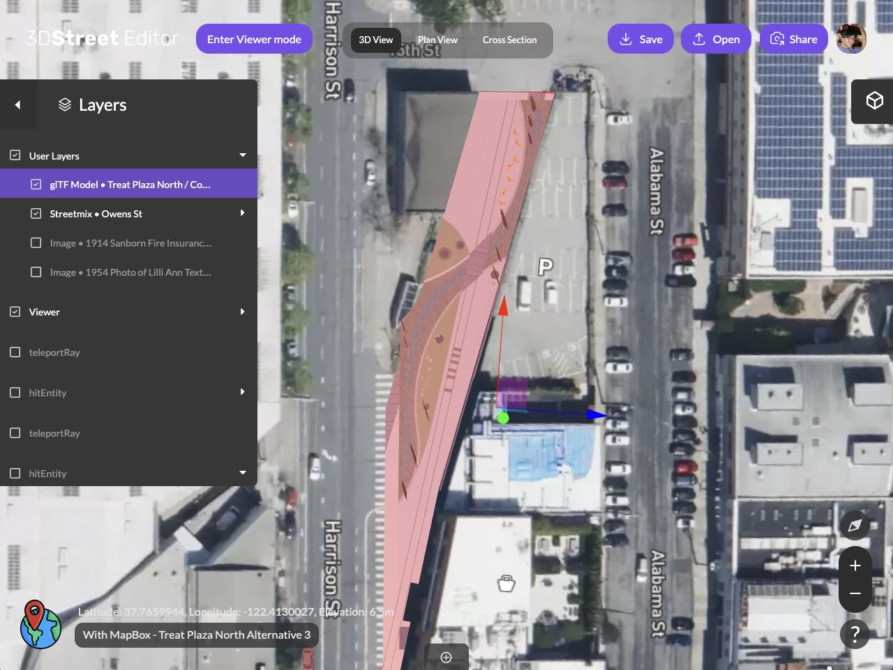
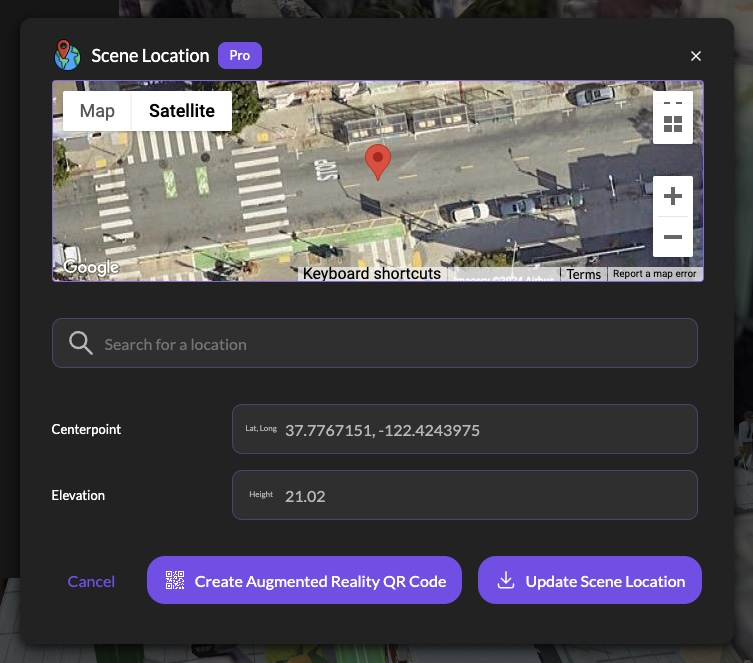

We’re thrilled to announce the early access launch of 3DStreet Geospatial Pro introducing groundbreaking 3D map integrations, drag-and-drop 3D model placement, augmented reality features, and more.

**Community advocate Andrew Seigner used 3DStreet Geospatial Pro to propose a few alternative treatments for a Hayes Street Promenade in San Francisco.**

<!-- truncate -->
## Why 3DStreet Geospatial Pro?
Since launching 3DStreet in 2017, our mission has been to empower everyone to reimagine public spaces. After the successful release of 3DStreet Cloud, we've listened to feedback from a diverse community of users—ranging from transportation engineers to community advocates. The common request? Tools to provide geographical context for street designs.

## Design Scenes with Integrated 2D & 3D Maps

**Aligning Sketchfab design of repurposed street plaza imported into a 3DStreet Geospatial Pro scene to combine with other elements.**

3DStreet Geospatial Pro makes it easy to integrate detailed 2D and 3D maps from various providers. Use Mapbox's 2D Satellite layer for fine detail and Google’s 3D Map layer for lifelike context. Each scene can now be linked to specific geographical coordinates, unlocking advanced geospatial features like QR-code based Augmented Reality.

**Setting a Scene Location is a simple as making a location query with Google Maps.**

## Add Objects and Layers Easily
Our rich library of custom-designed 3D objects is now more accessible with a new Add Entity panel. Browse and add everything from pedestrians and vehicles to buildings and street props to your scene with just a few clicks.

## Combine Advanced Street Geometry from Multiple Providers
We now support Street Layers from multiple street design platforms including Streetmix, StreetPlan, and an intersection component. Our users have shown ... blender, splat / lum ai / polycam / dronedeploy / cesium, and many others / images / figma svg

## Optimized glTF Export for Augmented Reality
We've simplified AR visualization with an “Optimized for AR” export option. This feature automatically prepares your 3DStreet scenes for use in AR apps like Adobe Aero and inCitu, eliminating the need for additional 3D editing software.

## Upcoming AR Features
We are also developing QR-based AR features for quick field use, allowing immediate scene placement without needing third-party apps.

## Pricing and Availability
3DStreet Geospatial Pro is available as a subscription for $49/month, with discounts for annual payments. While most existing free features will remain available, advanced features like geospatial tools, smart layers, and AR export will be part of the Pro plan.

## Early Access
Ready to revolutionize your street designs? Contact us to get access to 3DStreet Geospatial Pro and transform your projects with cutting-edge features! 

// shared calendly invite 25 min geospatial-pro-early-access
