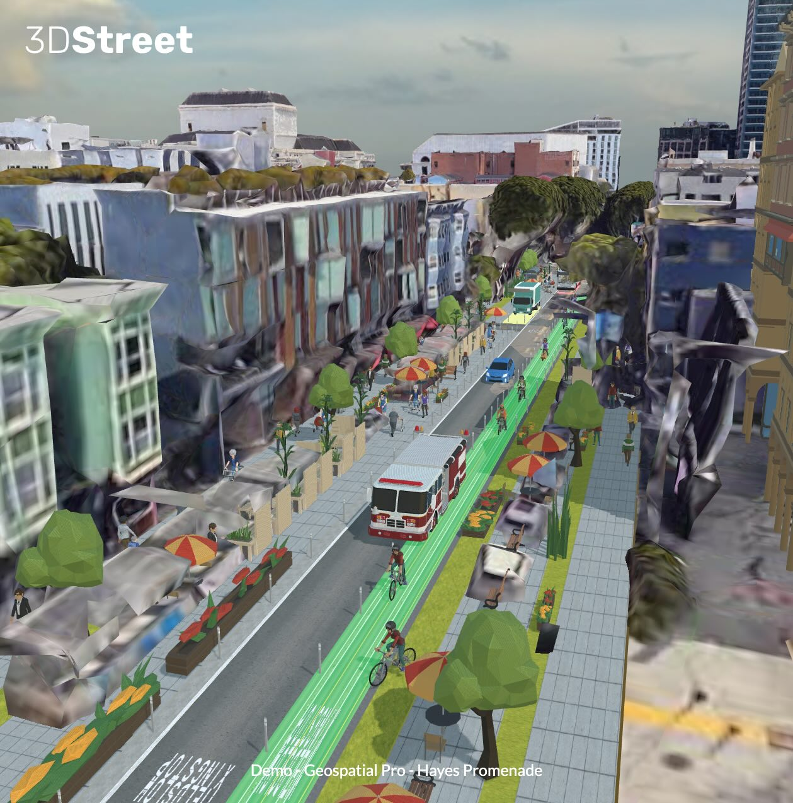
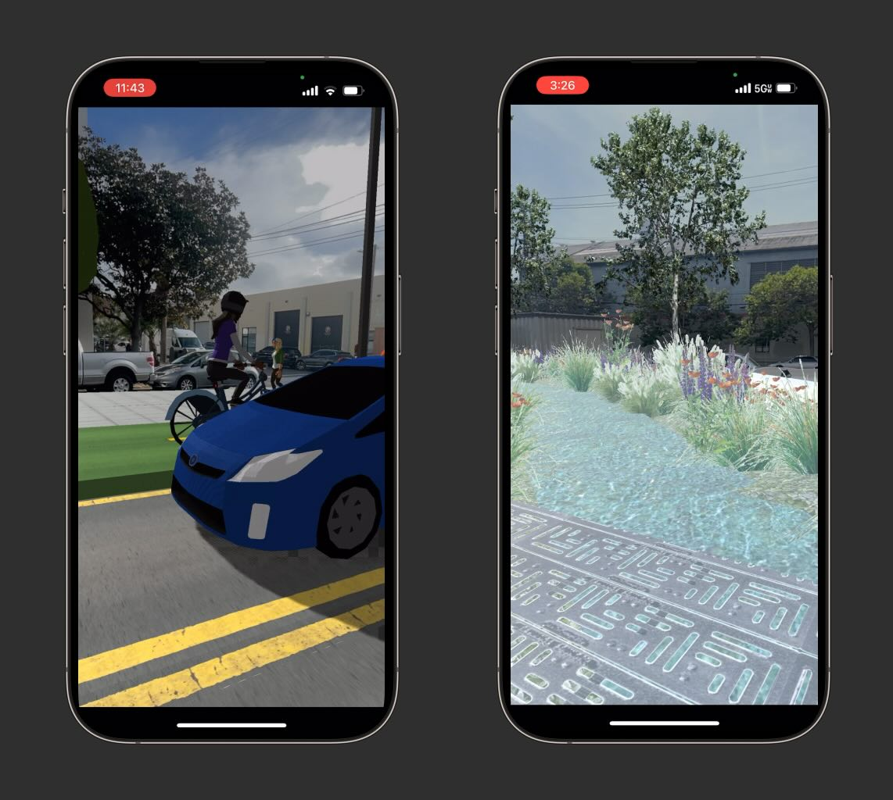

We’re thrilled to announce the early access launch of 3DStreet Geospatial Pro introducing groundbreaking 3D map integrations, drag-and-drop 3D model placement, augmented reality features, and more.

 <i>
**Community advocate Andrew Seigner used 3DStreet Geospatial Pro to propose a few alternative treatments for a Hayes Street Promenade in San Francisco.**</i>

<!-- truncate -->
## Why 3DStreet Geospatial Pro?
Since launching 3DStreet in 2017, our mission has been to empower everyone to reimagine public spaces. After the successful release of 3DStreet Cloud, we've listened to feedback from a diverse community of users—ranging from transportation engineers to community advocates. The common request? Tools to provide geographical context for street designs.

## Design Scenes with Integrated 2D & 3D Maps

 <i>
**A proposed street plaza design from landscape architecture firm Terrain Studio aligned with real-world geometry using 3DStreet Geospatial Pro.**</i>

3DStreet Geospatial Pro makes it easy to integrate detailed 2D and 3D maps from various providers. Use Mapbox's 2D Satellite layer for fine detail and Google’s 3D Map layer for lifelike context. Each scene can now be linked to specific geographical coordinates, unlocking advanced geospatial features like QR-code based Augmented Reality.

 <i>
**Setting a Scene Location is a simple as searching for a place with Google Maps.**</i>

## Add Objects and Layers Easily
Our rich library of custom-designed 3D objects is now more accessible with a new Add Entity panel. Browse and add everything from pedestrians and vehicles to buildings and street props to your scene with just a few clicks.

 <i>
**Adding new layers and 3D models to your scene is as easy as scrolling and clicking.**</i>

## Combine Advanced Street Geometry from Multiple Providers
We now support Street Layers from multiple street design platforms including Streetmix, StreetPlan, and a new intersection component. Create your own custom paths by importing svg files from vector graphic editing software such as Figma. Coming soon, import custom 3D scans in Gaussian splat format created with applications such as LumaAI and Polycam.

 <i>
**Using a custom SVG paths created in Figma and imported into 3DStreet is a quick way to prototype a mode-separated traffic circle.**</i>

## Optimized glTF Export for Augmented Reality
We're simplifying AR visualization with an “Optimized for AR” export option. This feature automatically prepares your 3DStreet scenes for use in AR apps like [Adobe Aero](https://www.adobe.com/products/aero.html) and [inCitu](https://incitu.us/), eliminating the need for additional 3D model editing.

<iframe width="560" height="315" src="https://www.youtube.com/embed/SszAFmtmVC4?si=anecoEum53Y9C4sF" title="YouTube video player" frameborder="0" allow="accelerometer; autoplay; clipboard-write; encrypted-media; gyroscope; picture-in-picture; web-share" referrerpolicy="strict-origin-when-cross-origin" allowfullscreen></iframe> 
<i>**A first-person recording of street design changes created in 3DStreet composited with real-world imagery using Adobe Aero.**</i>

## Upcoming AR Features
We are also developing a 3DStreet mobile WebAR app providing Augmented Reality experiences using QR codes for localization.

 <i>
**Augmented Reality visualization allows realtime compositing of your proposed design placed in the real-world.**</i>

## Pricing and Availability
3DStreet Geospatial Pro is available as a subscription for $49/month, with discounts for annual payments. While most existing free features will remain available, advanced features like geospatial tools, smart layers, and AR export will only be available as part of the Pro plan.

## Early Access
Ready to transform your projects with cutting-edge geospatial features?

[Contact us to get Early Access to 3DStreet Geospatial Pro](https://us6.list-manage.com/contact-form?u=01ce9902276fa6ad96be57ac6&form_id=3f024b297f2177befa87b5ca5e9d45cc)