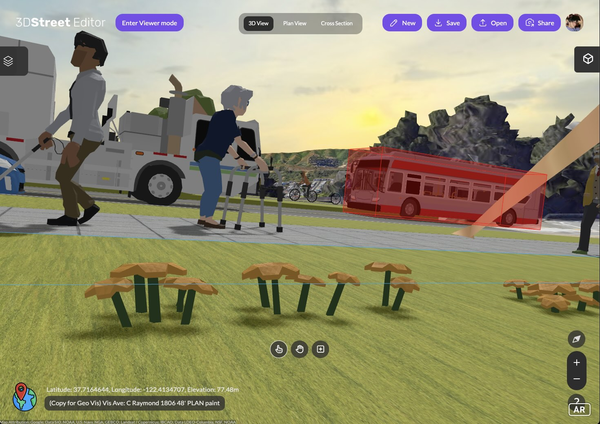
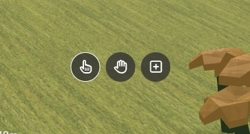
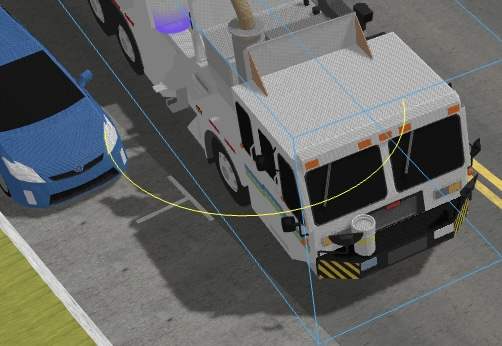

A heartfelt thanks to our intrepid group of first customers of 3DStreet Geospatial Pro since our launch 3 weeks ago. We’re honored by your support of a product still in the making, and to give thanks back we’d like to share these newly released features that you have directly funded and requested.

<!-- truncate -->

A shared theme of your feedback is that 3DStreet has been a big help for your projects – from feasibility to visualization for stakeholders and creating new designs – however we need to improve its usability, especially for new users.

## New Baby Toolbar

We’re proud to share our new baby toolbar: clocking in at 3 options, it’s a small but mighty one that we expect to grow quickly with your feedback and support. The toolbar is intended to help prevent “accidental selection and moves” where – during an attempt to move the camera view – a user unintentionally selects and moves an object. With no undo, this is a pain.

There are 3 toolbar options:
* Pointer - click to select and move an object
* Hand - a mode that prevents selection or moving objects, you can only click to move the view (press `shift` while clicking to rotate the view)
* New Object - clicking + will show the Add New Entity panel to add objects, smart layers, and more

While we work on undo, using the Hand mode is the safest way to browse a scene without making unintended changes.

## Many more improvements based on your project requirements and direct feedback:

* No more remix - the concept of remix was confusing so we have removed it. Now you can simply “Save” or “Save as…” 
* Bigger scenes – we now support scene sizes up to about 3 miles / 5km. (Previously the skybox was too small, so we made it bigger.)
* Fixing bugs – sometimes 3d tiles wouldn’t load so we fixed one of those cases, and sometimes the red and blue bounding box of your selected object was too large and didn't take into account rotation, so we fixed that too.
* New scene – Pro users now have “New Scene” which allows you to start from scratch and create a new geolocated scene
* Simplification of rotation controls – when placing streets and objects most users appear to be rotating around the vertical ‘y’ axis. Therefore we updated the default rotation transform controls (accessed by pressing ‘e’ keyboard shortcut) to only allow rotation on that axis:

* If you get really excited about product release notes you can check out the full release notes here: https://github.com/3dstreet/3dstreet/releases/tag/0.5.1

## New objects

You’ve also suggested new 3D models as options to include in your projects. Stay tuned to see what new models we’re launching thanks to the support of our Pro users! (That beautiful side loading garbage truck is a good preview!)

## Make it happen

If you're not one of our Early Access users, become one. 
Join our Geospatial Pro Early Access program now to help guide our next priorities to shape the future of our streets.

[Contact us to get Early Access to 3DStreet Geospatial Pro](https://us6.list-manage.com/contact-form?u=01ce9902276fa6ad96be57ac6&form_id=3f024b297f2177befa87b5ca5e9d45cc)  
