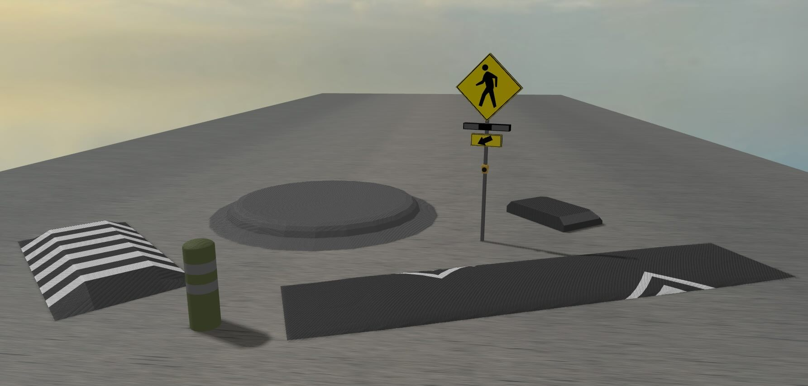
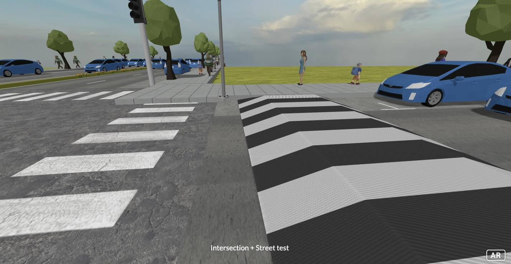
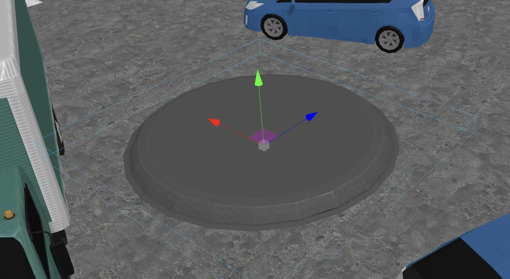
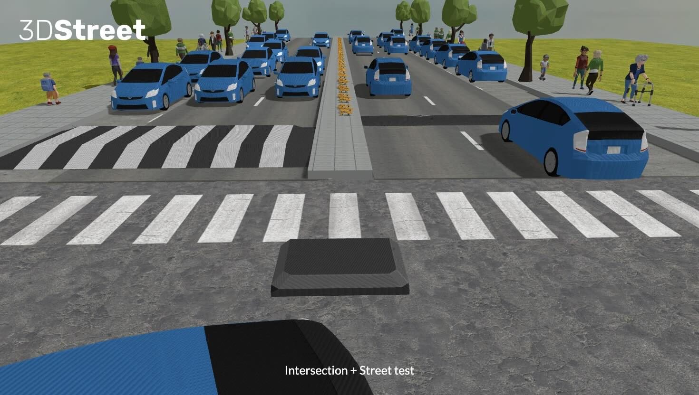
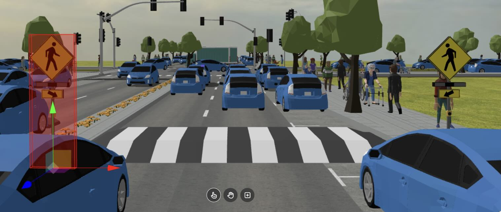
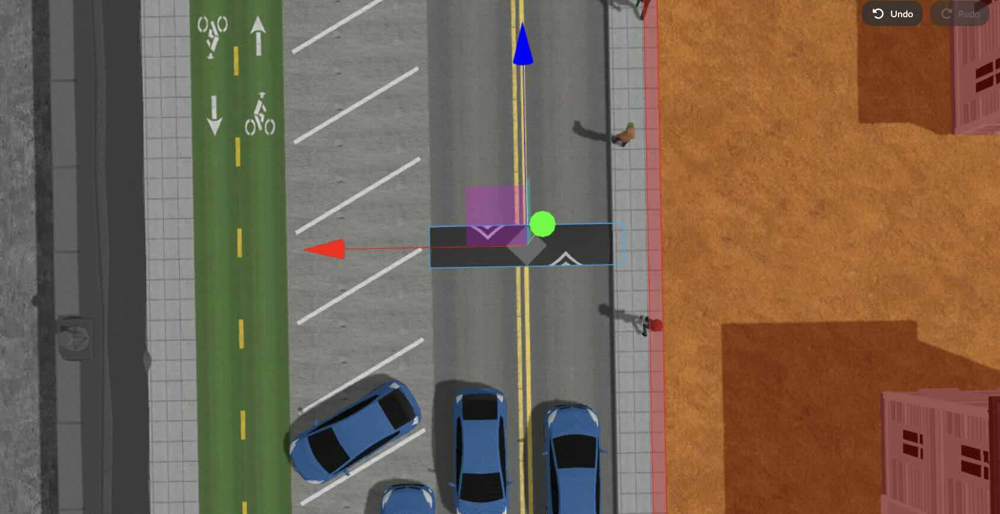
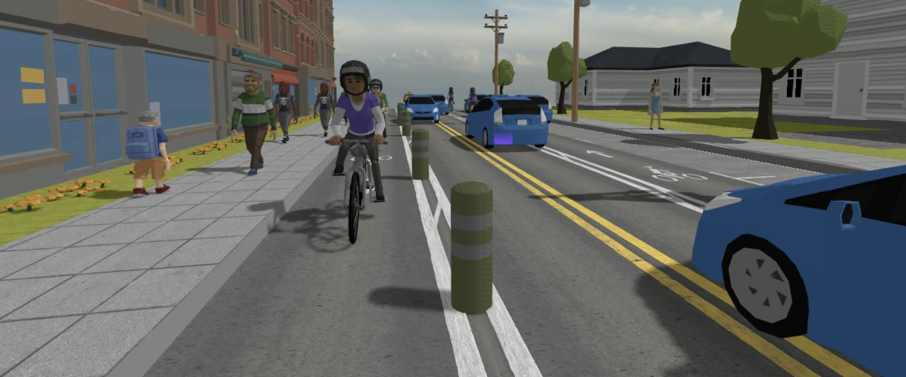

I'm Luke Walker, a recent graduate of the Immersive Media Communications Master's program from the University of Oregon and I'm proud to share the open-source release of 3D traffic safety device models as a result of a collaboration with the [University of Oregon’s Incubating Interdisciplinary Initiatives (I3) 2023 award program for "Developing Augmented Reality (AR) Visualization Tools to Increase Sustainable Transportation."](https://environment.uoregon.edu/latest-i3-seed-funding-cycle-supports-new-projects-city-planning-and-immersive-science)

The I3 program fosters new research projects across disciplines, in this case communications & planning -- advised by Dr. Danny Pimentel in UO's School of Journalism and Communication, Dr. Marc Schlossberg in UO's School of Planning, Public Policy and Management with 3DStreet serving as an outside technical partner.

<!-- truncate -->

One of the goals of the collaboration was to use Augmented Reality (AR) communication tools to visualize street redesigns for sustainability. During the prototype process I was tasked with finding ways to visually represent pedestrian and micro-mobility improvements in AR and was pleased to have found 3DStreet and its rich library of urban planning prototype models.

While 3DStreet's library of open-source urban 3D models was a great starting point, our project needed custom safety 3D models that were not available in 3DStreet to support Dr. Schlossberg's project goals. We partnered with the 3DStreet team on best-practices for low-polygon realtime 3D modeling on mobile devices with limited processing power for mobile Augmented Reality visualization. 

I created these models in Maya and worked with 3DStreet modeling expert [GnanaSai Reddy](https://www.upwork.com/freelancers/~0121c5733ab653a5c6) for conversion to glTF (source) and glb (distribution) for use in the 3DStreet app and to empower future open-source community use and remixing. 

## Raised Crosswalk

`Dividers & Traffic Control: street-element-crosswalk-raised`

Raised crosswalks reduce vehicle speeds and provide a safer environment for pedestrian crossing. The height of this 3d model allows users to see the elevated crosswalk clearly in Augmented Reality to understand the effect a raised crosswalk could have on an intersection or street crossing.

## Traffic Circle

`Dividers & Traffic Control: street-element-traffic-island`

The traffic island, circle, or roundabout forces the flow of traffic to move in one direction. Focusing traffic to exit the roundabout from just one direction, instead of three, simplifies the pedestrian and driver visual environment and interaction. This object was created to be used for smaller residential or larger multi lane streets and can be scaled depending on the need.

## Median Refuge Island

`Dividers & Traffic Control: street-element-traffic-island-end-rounded`

The traffic islands were created to be used as a refuge island for crossings, providing a safe place for pedestrians to stand on a street while reducing their danger from vehicles. Visualizing a refuge island in AR allows users to see they have the same protection on the island as they would on a sidewalk.

## Ped Crossing Rectangular Rapid Flashing Beacons (RRFB)

`Dividers & Traffic Control: street-element-sign-warning-ped-rrfb`

Rectangular Rapid Flashing Beacons (RRFBs) are used as visual cues for drivers that pedestrians are crossing the road at a crosswalk. City planners utilize RRFBs regularly for crosswalks needing multilane crossings. I made this object to replace the standard crosswalk signs with no flashing lights so individuals viewing it in AR could see how the placement of an RRFB would be helpful to promote a safer crossing environment. 

## Speed Hump

`Dividers & Traffic Control: street-element-speed-hump`

The speed hump, or bump, is used to promote slow traffic speeds on low volume, low speed roads.

## K71 Flexible Traffic Post

`Dividers & Traffic Control: street-element-traffic-post-k71`

Beefy and imposing, the US Reflector K71 flexible traffic post has helped [redefine bike lanes across North America](https://www.usreflector.com/product/k71-flexible-traffic-post/).

## What's next for Luke?
I’m honored to have been a contributor of these critical safety models for 3DStreet, and I'm excited to announce my upcoming
role with NASA as a post-graduate intern at NASA’s [Office of Communications Strategic Partnerships Engagement](https://www.nasa.gov/nasa-brand-center/strategic-partnerships/)! I'm extremely grateful for this unique opportunity. [Follow my journey on LinkedIn here.](https://www.linkedin.com/in/luke-walker-439b78119/)

## Use these traffic safety objects now!
Use these models now to create your own 3DStreet scene by launching the [3DStreet app](https://3dstreet.app/), then click `+` to add a new layer, and click the `Dividers & Traffic Control` category and scroll down to find these models.