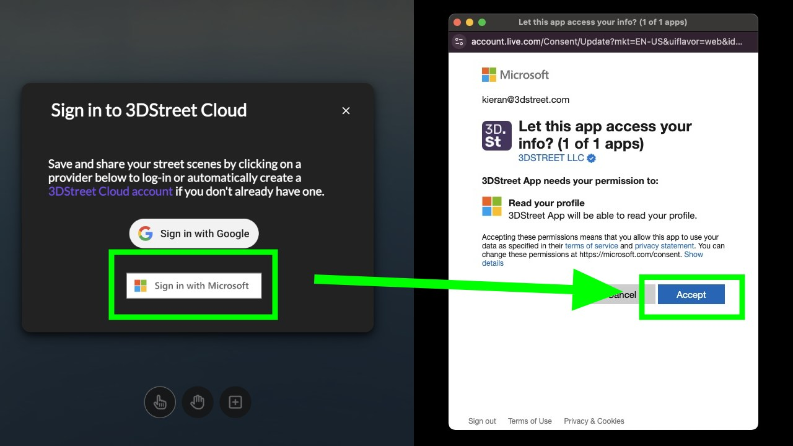
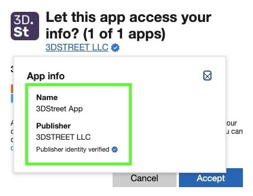

3DStreet now supports Microsoft login, making it easier for users with Microsoft accounts to access our platform. This update also includes important information for administrators on how to enable 3DStreet for their organization.

<!-- truncate -->

## New Microsoft Login Option

Users can now sign in to 3DStreet using their Microsoft accounts. This feature is available alongside our existing Google sign-in option, providing more flexibility for our users.

### To use the new Microsoft login:

1. Click on the "Sign in" button in the 3DStreet editor.
2. In the sign-in modal, you'll now see two options: Google and Microsoft.
3. Click on the Microsoft button to proceed with Microsoft authentication.

This addition makes it easier for users in organizations that primarily use Microsoft services to access 3DStreet seamlessly.

#### Preview of the new Microsoft login flow:

#### Look for Publisher Identity Verified
3DStreet LLC is a Microsoft Verified Partner. You should see a blue checkmark next to our name and clicking shows the following "App info":

## Administrator Guide: Enabling 3DStreet for Your Organization

For organizations using Microsoft Entra ID (formerly Azure AD), administrators may need to grant consent for 3DStreet to access user data. Here's how to do it:

1. Sign in to the [Microsoft Entra admin center](https://entra.microsoft.com) as a Global Administrator.
2. Navigate to "Identity" > "Applications" > "Enterprise applications".
3. Search for "3DStreet" in the list of applications.
4. Select the 3DStreet application.
5. In the left-hand menu, click on "Permissions".
6. Click on the "Grant admin consent for [Your Organization]" button.
7. Review the permissions requested by 3DStreet and click "Accept" if you agree.

By granting admin consent, you're allowing all users in your organization to use 3DStreet with their Microsoft accounts without individual consent prompts.

## Benefits of Admin Consent

Granting admin consent offers several advantages:

- Streamlined access for all users in your organization
- Reduced individual consent prompts, improving user experience
- Centralized control over application permissions

For more detailed information on the admin consent process, please refer to the [Microsoft documentation on application consent experience](https://learn.microsoft.com/en-us/entra/identity-platform/application-consent-experience#admin-consent-through-the-microsoft-entra-admin-center).

## Feedback and Support

We're excited to bring this new login option to our users and make 3DStreet more accessible for organizations using Microsoft services. If you encounter any issues or have feedback about the Microsoft login process, please don't hesitate to reach out to our support team.

Happy designing with 3DStreet!