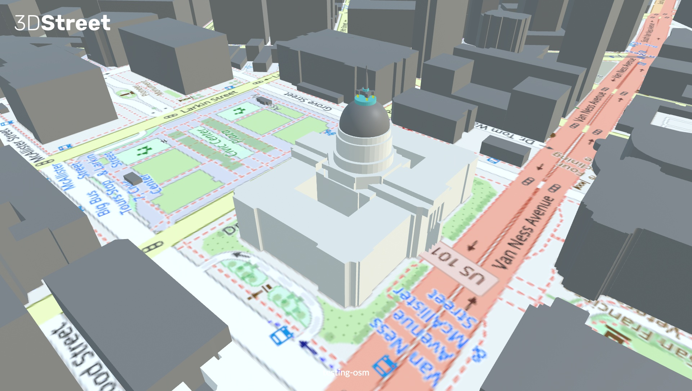
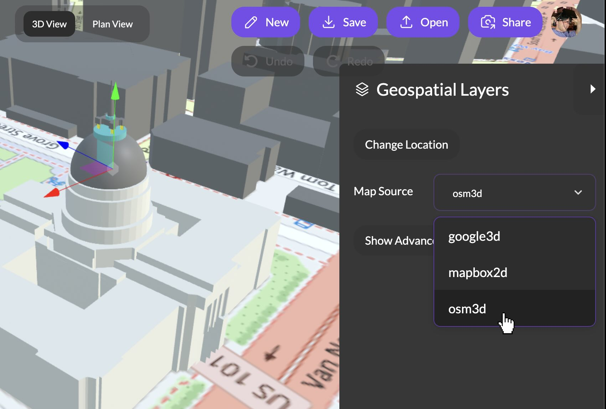

High resolution 3D map tiles have become a popular choice for adding immersive local context to 3DStreet scenes. However, sometimes the most interesting places on Earth have the least availability of detailed 3D map tiles -- such as large parts of Africa and South America. Even for locations with detailed 3D tiles coverage, we've heard from users that sometimes the realism of the 3D tiles can distract from the focus of presenting proposed street projects.

In these cases, our new integration with Open Street Map (OSM) offers new dimensions to our mapping capabilities.

# PICTURE HERE WITH SAN FRANCISCO CITY HALL

<b><i>A screenshot of the new 3DStreet OSM integration showing San Francisco City Hall.</i></b>

<!-- truncate -->

## Introducing Open Street Map Integration

3DStreet now offers integration with Open Street Map (OSM) as a new Geospatial Layer map source. This integration provides 2D political map ground tiles and 2.5D buildings through OSM GeoJSON buildings data. This feature is now available for all Geospatial Pro Plan users in addition to the existing map data providers Google Maps 3D Tiles and Mapbox 2D Satellite Maps.

<b><i>Click Geospatial Layer > Map Source > osm3d to use the new OSM data source.</i></b>

## The Advantage of Open Source Maps

Integrating OSM with 3DStreet continues our commitment to open-source collaboration. A key advantage of the OSM approach is that it allows you to leverage the existing OSM community and resources, ensuring that the data remains up-to-date and accessible to all. The 3DStreet integration today is "read only" and relies on existing OSM data, but [users wishing to update map data can do so through a variety of tools from the OSM ecosystem](https://wiki.openstreetmap.org/wiki/Contribute_map_data).

## More than just tiles - GeoJSON buildings

In addition to Open Street Map 2D ground tiles, the new OSM integration provides basic building geometry through GeoJSON OSM data sources. The basic building footprints provide just enough context in most cases for locals to understand the location of a proposed project, while not distracting from the focus on the proposed project itself.

This GeoJSON parser also opens the door to future integration of alternative geospatial data sources, although today this only supports closed polygons for buildings.

## A-Frame Component for OSM Integration

Similar to our other integrations, we've chosen to "build in the open" by contributing improvements to an existing A-Frame `OSM4VR` component designed by anonymous community member `ctrlw`.

You can view the original A-Frame component by *ctrlw* here [https://github.com/ctrlw/osm4vr](https://github.com/ctrlw/osm4vr) and [check out the 3DStreet version here](https://github.com/3dstreet/osm4vr) which adds webpack support to better handle dependencies as well as custom features to allow for integration with the 3DStreet Editor app. Like all parts of 3DStreet, we welcome community contributions to this component and others.

## What's Next?

Looking ahead, we're excited about the potential to support custom tiles. In addition to the political map, we aim to move beyond this basic OSM implementation and support private servers and alternate tile types. Our ultimate goal is to allow users to specify which tile type they prefer, providing even greater flexibility and customization.

Stay tuned for more updates as we continue to enhance 3DStreet's mapping capabilities and explore new ways to empower our users to reimagine public spaces.

You can help us shape the future of the 3DStreet OSM integration by providing your feedback through [email](mailto:team@3dstreet.com), [GitHub issues](https://github.com/3dstreet/3dstreet/issues), or our public Discord server (link in footer).
