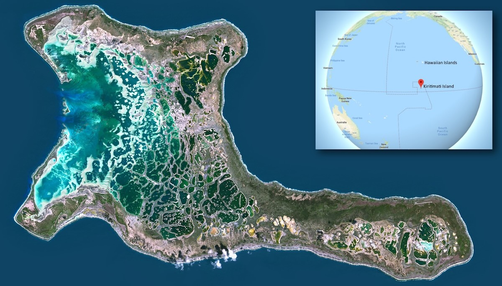
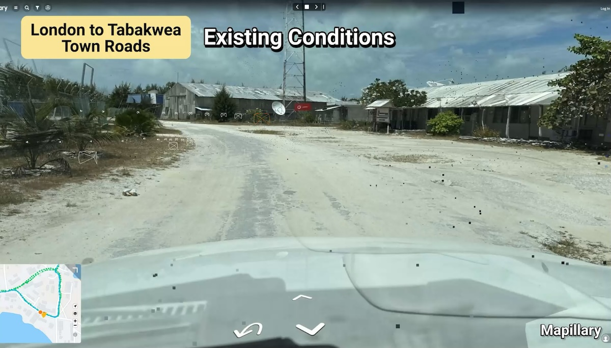
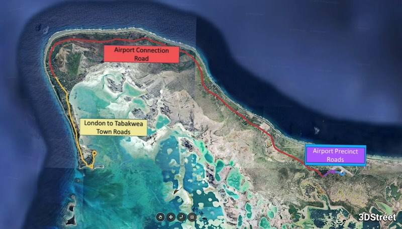
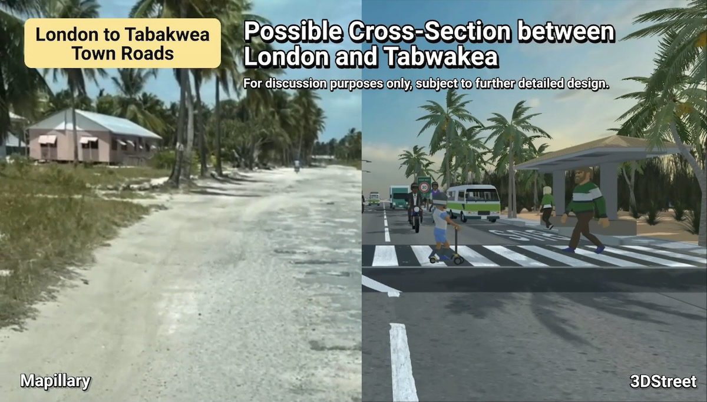

import MuxPlayer from '@mux/mux-player-react';

On Kiritimati Island (pronounced kee-ris-muh s) our team partnered with Sam Johnson and the World Bank Transport team to visualize how sustainable transportation infrastructure can support both current and future residents on the world's largest coral atoll.

<iframe width="100%" style={{"aspect-ratio": "16 / 9"}} src="https://www.youtube.com/embed/UepgiC2rFF0?si=0NXQTUbkllC4PKup" title="YouTube video player" frameborder="0" allow="autoplay;encrypted-media; picture-in-picture; web-share" referrerpolicy="strict-origin-when-cross-origin" allowfullscreen></iframe>

<!-- truncate -->

## An Island at the Crossroads

Located in the central Pacific Ocean, Kiritimati Island faces unique challenges as climate change reshapes the region. While the island's current population numbers only a few thousand, it may soon need to accommodate more residents from Kiribati’s other island which is increasingly vulnerable to rising sea levels.

## Planning Ahead for Change

The island's main road network currently reflects its small population and historic development patterns. The existing infrastructure is basic, with limited provisions for pedestrians, cyclists, or public transport. As we look toward a future where Kiritimati could play a crucial role in regional climate migration, these roads will need to evolve to serve a larger, more diverse population.

The current road infrastructure supports:
* Private vehicles, motorcycles, and cargo trucks
* Limited pedestrian movement
* Basic access to key facilities and settlements
* Connection between main population centers like London Town and Banana

## From Reality to Digital Twin

Working with key stakeholders including local government authorities and the [International Road Assessment Program](https://irap.org/), the team explored design solutions that would create safer, more inclusive streets while preparing for potential population growth.

Using 3DStreet's visualization capabilities, we created digital twins of both current conditions and proposed improvements across three critical areas that represent the diverse needs of transportation infrastructure on the island.

*Three areas of focus for the Kiritimati project*

## Reimagining Street Space
Proposed designs incorporate several key features to support sustainable mobility:
* Wider, shaded walkways to protect pedestrians from the tropical sun
* Slow speed zones in urban areas that safely mix vehicles, motorcycles, and bicycles
* Dedicated bus bays to support future public transport services
* Enhanced safety features based on iRAP assessment recommendations

<MuxPlayer
    streamType="on-demand"
    playbackId="C1OeGSoJiPbALG5kJXnoQpy6oGEEvLz8"
    primaryColor="#FFFFFF"
    secondaryColor="#000000"
    accentColor="#653CB0"
    autoplay="muted"
    loop
/> 

## Making the Case for Change
By combining Mapillary's street-level imagery with 3DStreet's visualization tools, we were able to create compelling before-and-after comparisons that helped stakeholders understand the tangible benefits of the proposed changes. This approach was particularly valuable given the unique context of planning for both current needs and potential future scenarios.

The visualization process helped demonstrate how relatively modest infrastructure improvements could significantly enhance safety and accessibility while building climate resilience. These visualizations are proving instrumental in making the case for infrastructure funding that considers not just today's needs, but tomorrow's challenges.

## Stretching the Capabilities of 3DStreet
The Kiritimati project pushed our platform in exciting new directions. While 3DStreet was originally designed for visualizing individual street segments, the World Bank team's requirements encouraged us to significantly expand our capabilities. The project's scope required handling multiple kilometers of roadway across three distinct sections, driving us to optimize our rendering pipeline while maintaining detail.

Creating locally appropriate assets and smooth fly-through animations that transition between current and proposed conditions required new approaches to both asset development and camera control. These technical challenges led to innovations in scene management and rendering that have since become standard features in our platform, benefiting visualization projects worldwide.

## Looking Forward
As climate change continues to impact Pacific island nations, the importance of forward-thinking infrastructure planning becomes increasingly critical. Through this project, we're demonstrating how digital twin technology can help communities like Kiritimati prepare for complex demographic and environmental changes while improving quality of life for current residents.

The visualizations we've created are helping stakeholders understand how streets can be transformed from basic transport corridors into vibrant, safe spaces that support sustainable mobility for all users. As we continue to refine these designs, we're excited to see how this approach could serve as a model for other islands facing similar challenges across the Pacific region.

## Read More
[Read the press release from International Road Assessment Program](https://irap.org/)

*Disclaimer: The views expressed in this blog post do not necessarily reflect the views of the World Bank Group.*