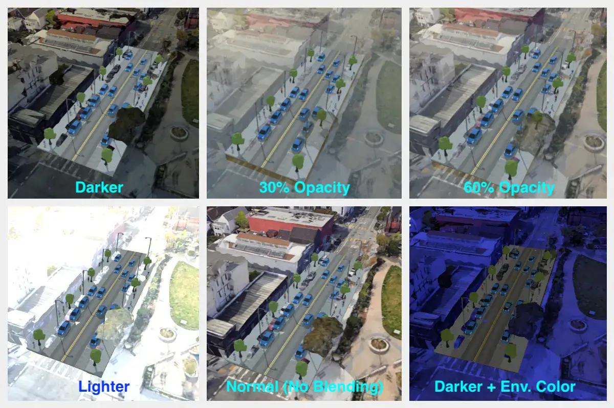
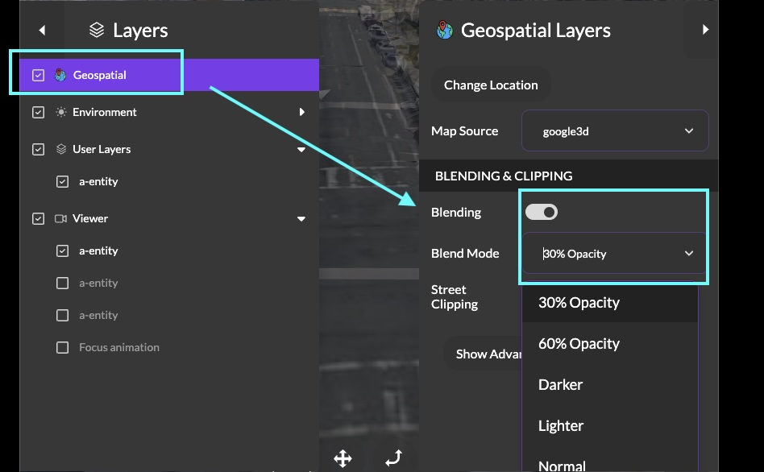
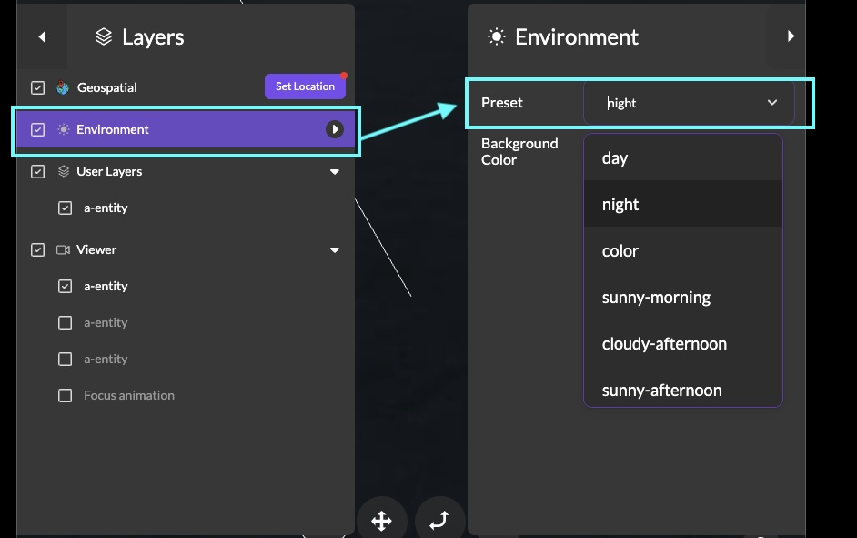
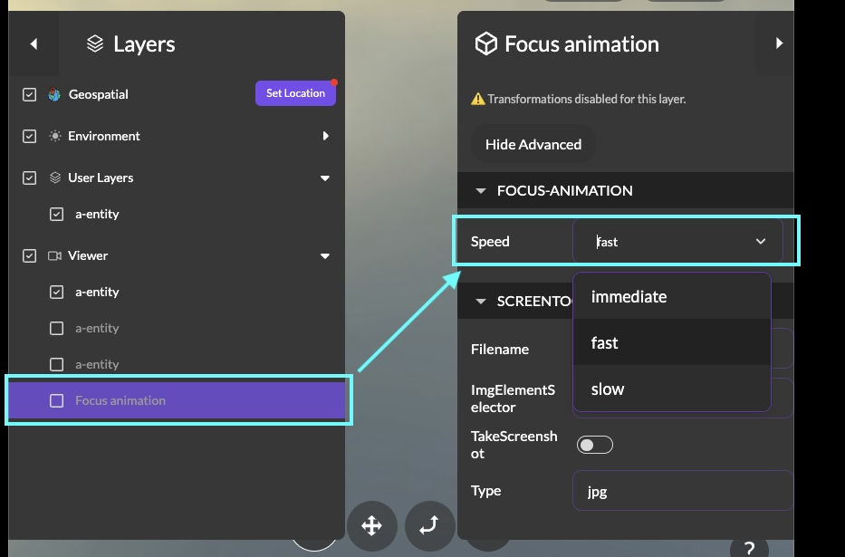

import MuxPlayer from '@mux/mux-player-react';

# New Feature Roundup: Map Layer Blending and Environment Settings

Introducing Map Blending and Environment Settings in 3DStreet! When combined these can allow for a wide range of creative options to mix street scenes with geospatial layers.

<!-- truncate -->

## Map Layer Blending

One of the most exciting new features we've been working on is adding a number of custom blending options for 3D map layers. To enable this, use the new Blending option in the Geospatial Layers panel, then choose your desired Blend Mode.

## Environment Settings

A common request is changing background and colorization of the environment in 3DStreet scenes. This is now possible with the new Environment Settings panel. Choose from presets including day, night, sunny morning, cloudy afternoon, and more. Or choose the color preset to select a custom background color.

## Combining Blending and Environment Settings

By combining blending and custom background colors you can create a huge range of creative interpretations for your scenes. Here's an example using the Dark blending mode and adjusting a custom background color:

<MuxPlayer
    streamType="on-demand"
    playbackId="9SjgPh01Wg6JHQ02017Yh7L39dQUnDTBO4i"
    primaryColor="#FFFFFF"
    secondaryColor="#000000"
    accentColor="#653CB0"
    autoplay="muted"
    loop
/> 

## Focus Animation Adjustment

When you double-click on an object in the viewport or in the layers panel, you'll notice a brief focus animation as the camera zooms into the focused object. The new Focus Animation Speed selector allows you to adjust the speed of the animation which can make it more suitable for creating quick videos and sharing. The focus animation is a simple way to add fly through effects to your scenes when sharing live or when recording with screen capture software. Click Viewer > Focus animation > Speed > slow to slow down the animation.

## Combining Everything Together

Combining all of these features together can create a wide range of creative options for your scenes.

<MuxPlayer
    streamType="on-demand"
    playbackId="8m300NuWWjv49R4xm67pZJ01uEBXoLPWz5"
    primaryColor="#FFFFFF"
    secondaryColor="#000000"
    accentColor="#653CB0"
    autoplay="muted"
    loop
/> 

## Try it out!
Click the "Launch App" button in the upper-right hand corner to play with these features (Pro plan required for Geospatial integrations) or join our discord below to provide more feedback on these features and what else you'd like to see in the future.