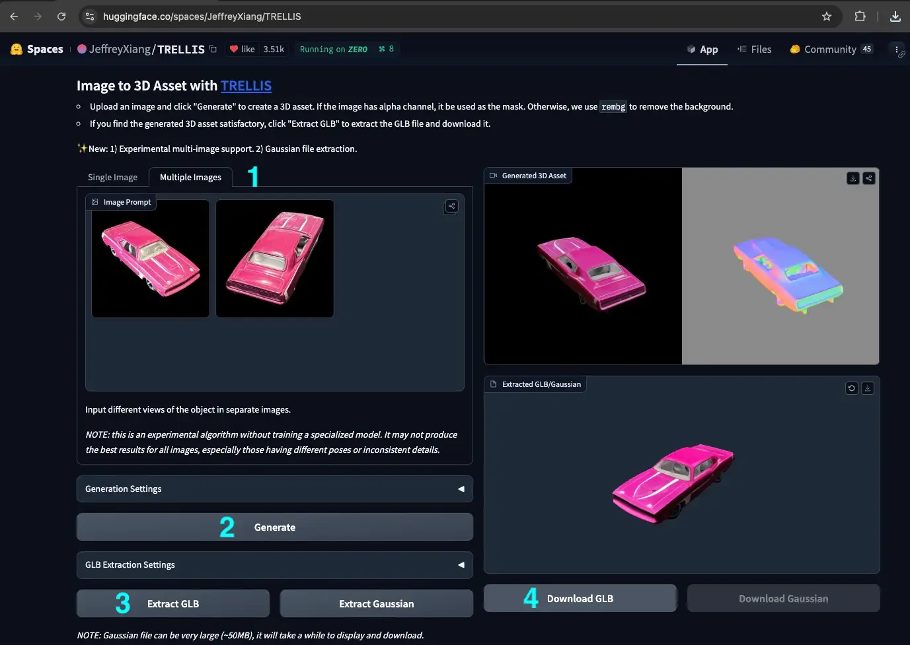

Have you ever found yourself designing a street scene and wishing you had that perfect 3D model to bring your vision to life? Whether it's a unique piece of street furniture, a local landmark, or even a toy car, traditional 3D modeling can be time-consuming and requires specialized skills. But what if you could turn any object into a 3D model with just a couple of photos and some AI magic? Let's explore how to do exactly that!

<!-- truncate -->

## The Power of AI-Generated 3D Models

Until recently, creating custom 3D models required extensive knowledge of 3D modeling software and hours of work. Now, thanks to advances in AI technology, tools like Microsoft's TRELLIS can transform simple photographs into usable 3D models in minutes. This opens up exciting possibilities for urban designers, planners, and anyone interested in creating more imaginative and personalized street scenes.

## Step-by-Step Guide to Creating Your 3D Model

### 1. Capture Your Reference Images

The quality of your 3D model starts with good reference photos. Here's what you need:
- Take 1-2 clear photos of your object from different angles
- Ensure good lighting and contrast
- A neutral background works best
- Include both front and side views when possible

### 2. Generate Your 3D Model with TRELLIS

Head over to [TRELLIS on Hugging Face Spaces](https://huggingface.co/spaces/JeffreyXiang/TRELLIS) to start the conversion process.

1. Upload your reference photos -- make sure to click on the "Multiple Images" tab if you have more than one
2. Click "Generate" and wait for the AI to work its magic. Review the preview to ensure it captures your object well.
3. If the preview looks good, click "Extract GLB" to generate a GLB version of the model.
4. Click "Download GLB" to download your 3D model

If the first attempt doesn't look quite right, consider using more than 1 picture. Try for soft lighting instead of bright specular reflections and ensure the object is in focus and entirely in frame. 

You can also try [Hunyuan3D-2](https://huggingface.co/spaces/tencent/Hunyuan3D-2), which allows you to generate 3D models directly from text descriptions.

### 3. Validate Your Model

Before proceeding, it's helpful to verify your model:
1. Visit [gltf-viewer.donmccurdy.com](https://gltf-viewer.donmccurdy.com/)
2. Drag and drop your GLB file into the viewer
3. Confirm the model loads correctly and looks as expected

### 4. Optimize for Web Use

Your initial model might be larger than necessary. Here's how to optimize it using [OptimizeGLB.com](https://optimizeglb.com):

1. Upload your GLB file. Enable Draco compression (but avoid mesh simplification)
2. Click "Process All Files"
3. Right-click the "Download" button, and
4. Click "Copy Link Address"

This step not only reduces file size but also gives you a hosted URL for your model.

### 5. Import into 3DStreet

Finally, let's bring your model into 3DStreet. Open the [3DStreet App](https://3dstreet.app/), and then:

1. Click "Add Layer"
2. Choose the "Custom Layers" tab
3. Select "GLTF Model from URL"
4. Paste your OptimizeGLB link URL
5. Adjust scale, position and rotation as needed after adding to the scene

See our [documentation on importing custom 3D models](/docs/3dstreet-editor/custom-models-and-images) for more details on this step. A 3DStreet Pro plan is required to use this feature.

## Tips for Success

- Start with simple objects that have clear shapes and details
- Take photos in good lighting conditions
- Use the validation step to catch any issues early
- Consider the final size and scale in your street scene
- Keep backup copies of your original files

## Share Your Creations!

We'd love to see what you create with this workflow! Share your models and scenes with the 3DStreet community on our Discord channel or tag us on social media.

## Looking Ahead

The intersection of AI and 3D modeling is evolving rapidly. Tools like TRELLIS are just the beginning, we're also seeing huge improvements in live style transfer to convert the low poly and low fidelity 3D tiles imagery into higher fidelity and more detailed 3D scenes.

Here's an example of using live image to image style transfer with KREA.ai, a user-friendly AI generative creation and manipulation service.

Remember, whether you're adding unique street furniture, local landmarks, or playful elements to your scenes, AI-powered 3D modeling can help bring your vision to life with unprecedented ease.

Want to see this process in action? Check out our video tutorial below:

<iframe width="100%" style={{"aspect-ratio": "16 / 9"}} src="https://www.youtube.com/embed/k39_3jWzX78?si=8HJBs5Jc5Ex5K0sK" title="YouTube video player" frameborder="0" allow="accelerometer; autoplay; clipboard-write; encrypted-media; gyroscope; picture-in-picture; web-share" referrerpolicy="strict-origin-when-cross-origin" allowfullscreen></iframe>

Happy modeling! 🚀