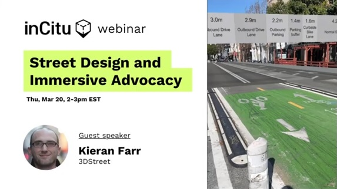
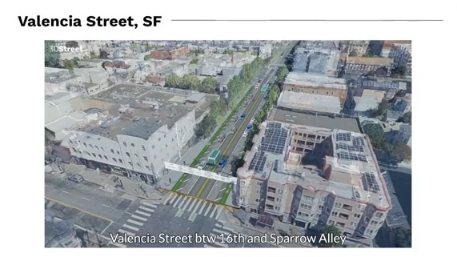
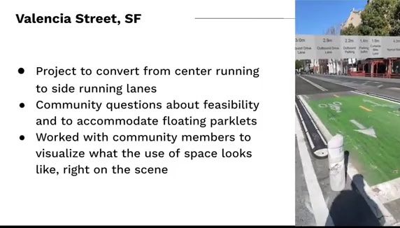
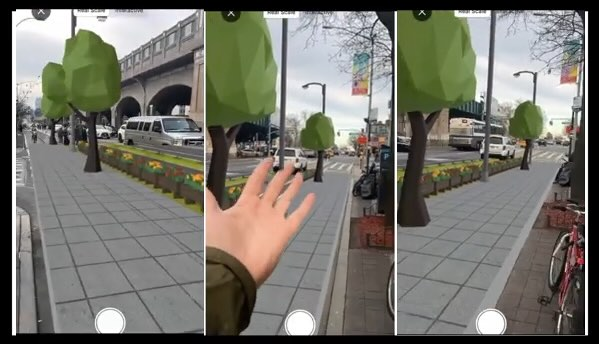
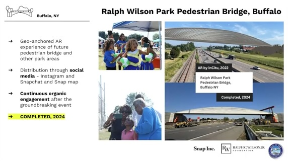
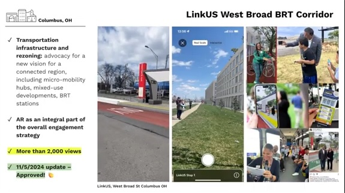
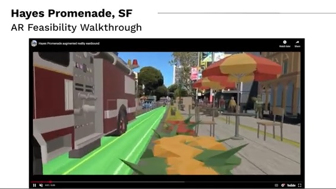

# Transforming Street Design Through Augmented Reality: Lessons from the Front Lines

#### How AR is revolutionizing community engagement and accelerating urban planning projects

 
The future of urban planning is happening right on our streets. In a recent webinar featuring 3DStreet founder Kieran Farr and InCitu's Nick, we explored how augmented reality (AR) is transforming community engagement with street design proposals.

<!-- truncate -->
 
 
Read our written adapation or skip to the [original webinar recording](#webinar-recording) to learn more.

## The Challenge: Bridging the Communication Gap

Urban planning has long struggled with a fundamental problem: **spatial communication is extremely difficult**. When engineers present striping drawings or two-dimensional plans to community members, you can see the disconnect in people's eyes. Small business owners, residents, and stakeholders often can't visualize how proposed changes will impact their daily lives.

This information asymmetry between professionals and communities leads to predictable outcomes: projects lose political support, get watered down, face delays, or are canceled entirely.

## Three AR Breakthroughs

### 1. AR as a Rapid Prototyping Feedback Loop
The game-changer isn't using AR to display finished designs—it's using AR for **rapid iteration at the earliest stages**. Instead of spending significant time in AutoCAD before getting community feedback, planners can now create quick prototypes, test them on-site, and iterate based on real-world constraints.

### 2. Converting Prototypes into Outreach Materials
Once refined through iterative AR testing, those same prototypes become powerful communication assets and can serve as the foundation for detailed design work in traditional tools like AutoCAD.

### 3. Democratizing Design: Anyone Can Do This
These tools are accessible to both professionals and amateurs. Community advocates, planning staff, and engaged residents can all participate in the design process.

## Real-World Case Studies

### Valencia Street Bike Lane Reconfiguration
A community advocate organized visualizations for the conversion of Valencia Street from center-running to curbside bike lanes. 
 

 

The AR perspective the new configuration from the actual perspective of a crossing pedestrian was recorded to video to provide content for education and advocacy.
 

### Queens Boulevard Improvements

A quick sample project created by Nick Kaufmann, a community manager at InCitu, to demonstrate how quickly he can create an example scene showing a sidewalk widening and protected cycle track improvement project.

### Buffalo Pedestrian Bridge
A pedestrian bridge connecting an underserved neighborhood to park amenities cut off by highways. The AR visualization told a dual story—both the bridge architecture and the narrative of neighborhood reconnection. The project was completed in 2024.

### Columbus Bus Rapid Transit
Central Ohio Transit Authority integrated AR into actual bus tours along proposed routes. The technology showed not just transit infrastructure, but walkable neighborhood development that transit investment could encourage. Officials used AR's people-occlusion feature for authentic social media content.
 

### The Hayes Promenade, San Francisco

Community advocate Andrew Seigner with <a href="https://www.hayespromenade.org/">Hayes Promenade</a> proposed converting a two-lane road with retail and parking into a single-direction lane with expanded pedestrian space. He "created an initial 2D design in Streetmix, imported it into 3DStreet, built it out in 3D space, and then use the AR Ready export option. This resulted in a complete augmented reality demo, where users can walk down our street with their phones, experiencing the proposal in first-person."

## Best Practices for AR Community Engagement

### Make It a Group Experience
AR isn't about individual visualization—it's about **unlocking conversations**. Successful implementations bring diverse groups together, often reaching stakeholders who wouldn't attend traditional civic meetings.

### Meet People Where They Are
Take AR proposals to farmers markets, street festivals, and existing community events. Mobile AR's portability makes it possible to engage communities in familiar, comfortable settings.

### Mix AR with Other Tools
The most effective campaigns combine AR with traditional outreach methods, web-based 3D maps, and other communication tools. In Columbus, embedding AR into a real bus tour created an immersive "trip to the future" that made abstract planning concepts tangible.

## The Emotional Power of Spatial Storytelling

Data alone doesn't change minds. When engaging with community members, statistics "roll off them like oil and water." The response to change is often emotional—people may intellectually understand that street safety is important, but they feel the loss of a parking space more acutely.

AR's power lies in **turning fear of loss into collaborative opportunity**. Instead of focusing on what's being taken away, these tools help communities envision positive alternatives: "You may be losing a parking space, but here's what you gain—and what would you like to gain?"

When people can see five new restaurant tables or beneficial rain gardens that prevent flooding, they start thinking: "I have agency to decide what could be there." This shift from loss aversion to collaborative visioning is where real change happens.

## Getting Started

Both 3DStreet and InCitu offer free tiers for experimentation. The basic workflow is simple:

1. **Create a scene** in 3DStreet with your target location
2. **Add and modify street elements** using drag-and-drop tools  
3. **Export as an `AR Ready` model**
4. **Import to InCitu** for location-based AR deployment
5. **Test and iterate** on-site, gathering community feedback

The most important insight from practitioners? **Start imperfect and iterate quickly**. The goal isn't award-winning renderings—it's making spatial concepts tangible enough for meaningful community engagement.

As cities face mounting challenges around housing, climate change, and equity, tools that democratize urban design and accelerate community engagement aren't just nice to have—they're essential for building sustainable, inclusive neighborhoods.

## Webinar Recording
<iframe width="560" height="315" src="https://www.youtube.com/embed/2-fBPCSc3s0?si=nzjVg2YkGL9dIqsp" title="YouTube video player" frameborder="0" allow="accelerometer; autoplay; clipboard-write; encrypted-media; gyroscope; picture-in-picture; web-share" referrerpolicy="strict-origin-when-cross-origin" allowfullscreen></iframe>

---

*Ready to experiment with AR for your next community engagement project? [Contact us to get started.](/contact)*