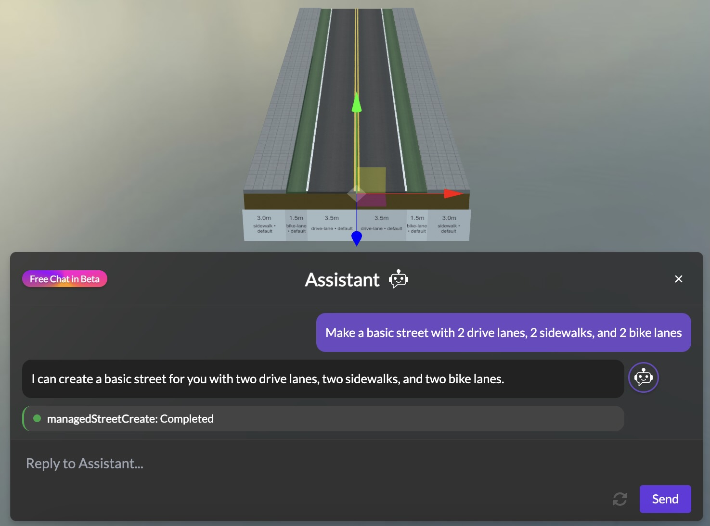
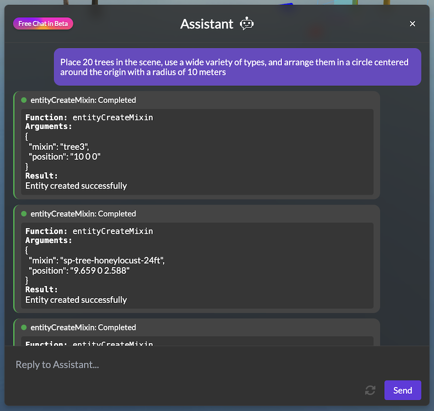

The new AI Assistant is here, and it's transforming how we create and modify street designs in 3DStreet! To help you hit the ground running with this powerful new feature, we've compiled a list of 10 essential prompts that showcase its capabilities and will help you optimize your design workflow right away.

<!-- truncate -->

## Getting Started with AI Assistant Prompts

Following our [recent announcement](/blog/2025-05-22-introducing-ai-assistant-beta-your-creative-partner-for-street-design) of the AI Assistant beta, we've already seen users discovering creative ways to leverage this tool. These prompts range from simple shortcuts to complex design tasks – all made accessible through natural language commands.

Let's dive into the top 10 prompts you should try today:

## 1. Make a Street



The most fundamental prompt is also one of the most powerful. Simply click the "Create Street" button shortcut or type:

```
Create a street with two drive lanes, two sidewalks, and two bike lanes
```

This instantly generates the foundation of your scene, and you can easily modify these parameters before generation. It's the perfect way to kickstart any project without manually placing individual street elements.

## 2. Take Snapshots

Documentation and presentation are crucial parts of the design process. With the "Take Snapshots" button shortcut, the AI Assistant will capture three views of your scene:
- Your current perspective view
- A bird's eye view from above
- A head-on view of your street

These images export directly as PNGs to your computer, making it effortless to share your vision or include in presentations.

## 3. Generate Report

Need to communicate the impact and purpose of your design? The "Generate Report" button shortcut prompts a form where you can specify:
- Current conditions
- Problem statements
- Proposed solutions

The AI Assistant then creates a comprehensive report with snapshots highlighting how your design addresses the specified challenges – perfect for stakeholder presentations or community engagement.

## 4. Insert Objects

Populating your scene is simple with commands like:

```
Insert a tree on the northeast corner of the intersection
```

```
Add three benches along the north sidewalk
```

The AI understands spatial relationships and object types, making scene population intuitive and fast.

## 5. Rotate Elements

Fine-tuning your scene is easy with rotation commands:

```
Rotate the food truck 45 degrees clockwise
```

```
Turn the bicycle rack to face the street
```

This eliminates the need to manually adjust rotation values, especially when you're aiming for specific orientations.

## 6. Generate Ideas


The AI Assistant isn't just for execution – it's an ideation partner too. Try prompts like:

```
What elements could I add to make this street more pedestrian-friendly?
```

```
Suggest ways to improve bicycle safety at this intersection
```

The assistant responds with context-aware suggestions based on urban design principles and your current scene.

## 7. Clone Objects

Quickly populate your scene with multiple similar elements:

```
Clone this car three times along the parking lane
```

```
Duplicate this tree every 20 feet along the sidewalk
```

This dramatically speeds up the process of adding repeating elements like street trees, parking spots, or seating areas.

## 8. Resize Objects

Adjust dimensions easily with natural language:

```
Make the sidewalk 50% wider
```

```
Resize the bike lane to 6 feet wide
```

This tool is particularly useful when adjusting street dimensions to meet specific standards or when testing different space allocations.

## 9. Change Materials

Transform the look and feel of your scene instantly:

```
Change the road surface to cobblestone
```

```
Update the bike lane material to green asphalt
```

This capability allows for quick material studies without navigating through material menus.

## 10. Change Objects

Need to swap elements in your scene? Simply tell the AI what you want to replace and with what:

```
Replace the sedan with a food truck
```

```
Change the maple trees to palm trees
```

This flexibility makes iterating through design alternatives seamless and efficient.

## Unlocking New Possibilities

These prompts are just the beginning of what's possible with the AI Assistant. As you become more familiar with its capabilities, you'll discover your own workflow shortcuts and command combinations that make street design faster and more intuitive than ever before.

The beauty of the AI Assistant is its ability to understand natural language, so don't be afraid to experiment with different phrasings and commands. The system is designed to interpret your intent, even if you don't use the exact wording shown in our examples.

## Share Your Discoveries

Have you found an innovative way to use the AI Assistant? We'd love to hear about it! Join our [Discord community](https://discord.gg/3dstreet) (link also in the footer) and share your favorite prompts and workflows. Your insights could help fellow designers unlock even more potential from this powerful tool.

For more information on the AI Assistant, check out our [documentation](/docs/key-features/ai-assistant) and stay tuned for future updates as we continue to enhance this feature based on your feedback.

Happy designing!
