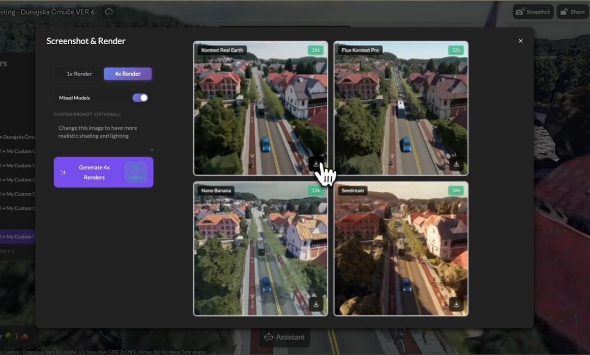

# More in Pro: AI Generation, Custom Prompts, and Enhanced AR Capabilities

I created 3DStreet with a vision to make street design tools accessible to a wide range of folks who may not have had access to professional design software. If I could wave a magic wand, I'd offer all of our features for free, but I can't. So, the next best thing is to make these tools affordable while covering our costs.

To that end, I'm happy to announce that as of September 1, 2025 we're now offering more in our 3DStreet Pro plan, adding new cloud AI image rendering which incorporates 4 frontier image generation models and AR viewing for Android and iOS devices. Pro users now have these new cutting edge features at no additional cost.

 
 

<!-- truncate -->

## 100 AI Generation Tokens Every Month

Every Pro subscriber now receives 100 AI generation tokens monthly to create photorealistic renderings of their street designs. These tokens unlock our powerful AI rendering pipeline that transforms your 3D scenes into compelling visualizations.

With AI generation, you can:
* Create photorealistic images for presentations and stakeholder meetings
* Generate multiple style variations of the same scene
* Produce images that better convey the feeling and atmosphere of your proposed designs
* Export high-resolution images without watermarks

Choose from 4 leading image-to-image generation models:
* Flux Kontext Pro by [Black Forest Labs](https://bfl.ai)
* Seedream 4.0 by [ByteDance](https://seed.bytedance.com/en/seedream4_0)
* Nano Banana by [Google Gemini 2.5 Flash Image](https://developers.googleblog.com/en/introducing-gemini-2-5-flash-image/)
* Real Earth Kontext Pro LoRA Model by [Ismail Seleit](https://www.linkedin.com/in/ismailseleit/)

<a href="https://3dstreet.app/#payment-model-annual" target="_blank">Pro Annual</a> subscribers get an extra bonus: **840 AI generation tokens** on first purchase – that's 7 months worth of tokens upfront to jumpstart your creative projects.

## Custom Prompts for AI Rendering

Pro users can now customize AI generation prompts, giving you precise control over the style and mood of your rendered scenes. Want a sunny morning atmosphere? A rainy evening scene? Dinosaurs and robots with lasers roaming the streets? Simply describe your vision in the prompt field.
 
 

## Import and Export GLB and Image Files

Professional workflows demand flexibility, and Pro users can now import and export GLB files -- the industry standard for 3D content -- and import images to create truly custom simulation environments. This opens up powerful new workflows:

### Import Custom 3D Models
* Bring in custom-designed street furniture from Blender or other 3D tools
* Add unique local elements that make your designs more authentic
* [Import AI-generated 3D models](/blog/2025/02/06/creating-custom-models-with-ai-for-creative-street-scenes)

### Import Image Models
Pro users can now work with various image formats to enhance their street designs:
* Example of local style signs for speed limits and town welcome signs for [Kiritimati Island](/blog/2024/12/15/visualizing-climate-resilient-infrastructure-kiritimati-sustainable-streets)
* Import equirectangular 360 images for use in [geolocated AR visualization](/blog/2025/08/13/creating-ar-scenes-with-historic-imagery-and-viewer-mode)
* Use an existing design or plan drawing as an image to use as a reference for designing in 3DStreet

### Export for Professional Applications
* Export your complete scenes as GLB for use in presentations
* Integrate with professional visualization pipelines
* Export "AR Ready" formats with simplified geometry made specifically for [third-party Augmented Reality apps](https://www.3dstreet.com/docs/key-features/ar-ready-export/)

## Enhanced AR Support for iOS Devices

Pro users can now share AR experiences on both iOS and Android devices, dramatically expanding your ability to showcase designs in real-world contexts.

### iOS AR Mode (Pro Feature):
* iOS AR support via [Variant Launch](https://launch.variant3d.com/)
* No app installation required – works directly in Safari
* Share AR scenes via QR codes or direct links

### WebXR AR Mode (free feature):
* Works on Android devices and AR headsets
* More interactive features and controls
* Real-time scene adjustments in AR

## Unlimited Geospatial Tokens

While free users get limited trial geospatial tokens, Pro users enjoy **unlimited access** to all geospatial features:

* Set scene locations anywhere in the world
* Integration with Google 3D Tiles and satellite imagery
* Generate automatic location descriptions

## Clean, Professional Exports

Pro allows users to download JPEG snapshots without the "Free Community Edition" watermarks, perfect for:
* Professional presentations and reports
* Grant applications and funding proposals
* Community engagement materials
* Social media and marketing content

## Pro Annual: Best Value for Professionals

For professionals committed to transforming street design, Pro Annual offers the best value:

* **Save 30%** compared to monthly billing
* **840 bonus AI generation tokens** on first purchase
* All Pro features for a full year
* <a href="https://3dstreet.app/#payment-modal-annual">Save with Pro Annual</a>

## Ready to Go Pro?

Whether you're creating compelling visualizations for community meetings, designing safer streets, or exploring creative possibilities, 3DStreet Pro gives you the tools to bring your vision to life.

<a href="/pricing" target="_blank">Upgrade to Pro Today</a>

Join our growing community of Pro users who are reimagining streets around the world. Have questions or need help getting started? Visit our [Discord community](https://discord.gg/zNFMhTwKSd) where Pro users share tips, showcase their work, and help each other create amazing street designs.

---

*Already a Pro user? Make sure you're taking full advantage of these features in the [3DStreet app](https://3dstreet.app/).*