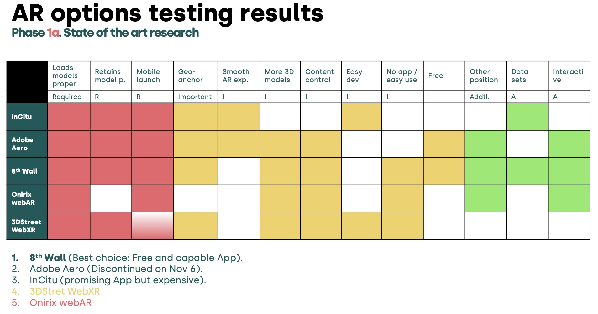

Can augmented reality transform how communities engage with street redesigns? A research collaboration between University of Cincinnati's Future Mobility Design Lab, MIT City Science Lab, and 3DStreet just proved the answer is yes—and created a replicable blueprint for cities worldwide.

<!-- truncate -->

## The Challenge

Communities struggle to imagine proposed street changes, leading to project delays, pushback, and [eroded trust between residents and agencies](/blog/2024/04/22/community-led-planning-trends-at-caltrans-equity-advisory-committee#the-challenge---negative-trust-spiral). The UC team, led by Alejandro Lozano Robledo with researchers Mythili Emani, Domagoj Bui, and Andrea Maravic, asked two questions:

1. **Is accessible AR technically feasible?** Can we deliver on-site experiences using just smartphones, no apps required?
2. **Does it actually improve engagement?** What happens when communities can walk through future streets before they're built?

After testing at Cincinnati's Short Vine and University Avenue intersection, both answers came back strongly positive.

## Technical Analysis: Evaluating AR Platforms

With numerous AR technologies available, it's difficult to determine which is best suited for community engagement without thorough evaluation. Quick trials don't reveal the nuances of reliability, accessibility, and user experience that emerge in real-world deployment. The UC team conducted a comprehensive analysis of five platforms across 13 test dimensions: <a href="https://helpx.adobe.com/aero/aero-end-of-support-faq.html">Adobe Aero</a>, <a href="https://incitu.us/">InCitu</a>, WebAR via <a href="https://www.onirix.com/">Onirix</a>, WebXR via <a href="https://www.3dstreet.com/docs/key-features/viewer-modes#ar-mode">3DStreet</a>, and <a href="https://8thwall.com/">8th Wall</a>. Test dimensions included geo-anchor support, authoring app usability, ability to reproduce model accurately including scale, and more as [detailed in the full published report](https://dam-prod.media.mit.edu/x/2025/09/23/Window%20into%20the%20Future%20-%20FINAL%20PRESENTATION%20-%20UC-MIT-3DStreet.pdf).

*Consumer Reports-style comparison of AR platforms evaluated for the UC pilot, [excerpt from **A Window into Our Future: an Augmented On-Site Experience**](https://dam-prod.media.mit.edu/x/2025/09/23/Window%20into%20the%20Future%20-%20FINAL%20PRESENTATION%20-%20UC-MIT-3DStreet.pdf)*

### Top Platform Choice: 8th Wall

[8th Wall emerged as the top choice](https://8thwall.com/) for this use case, though not by a landslide:

- **No app required for viewing**: 8th Wall was the most reliable experience working in mobile browsers on many devices without need for additional apps or specific API support.
- **Visual Positioning System (VPS)**: More reliable than GPS-only anchoring

However the decision wasn't straightforward. Adobe Aero and its AR distribution platform tested even better than 8th Wall, but was [recently discontinued by Adobe](https://helpx.adobe.com/aero/aero-end-of-support-faq.html). The WebXR Device API is a standard supported by a who's who coalition of device and browser vendors, but the research team found inconsistent support even for devices which professed WebXR compatibility.

### Honorable Mention: InCitu

[InCitu](https://www.incitu.us/) is a professional-grade platform that leverages native SLAM (Simultaneous Localization and Mapping) features built into modern smartphones. While more expensive than other offerings, it may be particularly appropriate for professional architecture and planning use cases where precision and reliability justify the investment. Learn more about InCitu's capabilities in our [joint webinar on AR for street design](/blog/2025/04/01/joint-webinar-street-design-and-immersive-advocacy).

### Dishonorable Mention: WebXR Standard

Two platforms use a web API called "WebXR" -- an open API for augmented and virtual reality on the web: Onirix and 3DStreet's built-in [AR Viewer Mode functionality](https://www.3dstreet.com/docs/key-features/viewer-modes/#ar-mode). The research team found insufficient support across devices used by target communities. Especially notable was lack of native support in some models of Samsung and iPhone devices. 3DStreet offers support for iOS devices with a third-party AppClip solution [Variant Launch](https://launch.variant3d.com/).

*Editor's note: As a long-time proponent of the WebXR standard, it pains me to admit that while it's a great solution when it works through its access to native-level SLAM APIs, device and browser support is simply not sufficient enough to be used in consumer applications for the general public to be accessible on a wide range of devices.*

## Storytelling Innovation: Personas Over Data

The research team experimented with visual presentation design in addition to testing AR platform technology.

Instead of floating statistics, the team created diverse character avatars -- ie. local business owners, elderly residents, families -- each explaining how changes affect their lives. Speech bubbles combined personal stories with real data: "These streetscape improvements didn't just look better—crime dropped 40%." (Example for experimentation of display and communications, not actual data from any specific site.)

As Luis Alonso from MIT noted, personas could show current problems, then reappear in the redesigned street celebrating improvements—creating emotional narrative arcs that abstract data cannot.

"When I see the person and their speech bubble, I can't stop myself from reading," noted another researcher. "Unlike floating data visualizations, which I ignore."

## The User Experience

Participants scan a QR code (paper prototype, eventually stickers or spray-painted markers), explore the AR scene for 2-3 minutes, walk to different corners to reveal layered information, then complete a survey. Directional markers guide users to optimal viewing positions.

The team documented everything with 360° cameras and the captured content and immersive AR experience can also be leveraged as immersive training materials for future facilitators.

## Why This Research Matters

This work helps to validate that accessible AR can meaningfully improve transportation planning engagement without expensive equipment, proprietary software, or specialized expertise. The framework shifts conversations from loss aversion ("you're taking my parking!") to collaborative opportunity ("what should we gain here?").

For 3DStreet users, the workflow is proven: Create scenes in 3DStreet, export as "AR Ready," deploy through 8th Wall or InCitu, then iterate based on community feedback.

As cities face mounting challenges around climate, housing, and equity, democratizing urban design is an opportunity to make positive change quickly.

---

*Based on research by University of Cincinnati (Alejandro Lozano Robledo, Mythili Emani, Domagoj Bui, Andrea Maravic), MIT City Science Lab (Luis Alonso), and 3DStreet (Kieran Farr). Read more at [UC Digital Futures](https://ucdigitalfutures.com/blueprint-for-civic-co-creation/) and [MIT Media Lab](https://www.media.mit.edu/projects/a-window-into-our-future-community-an-augmented-on-site-experience/).*
