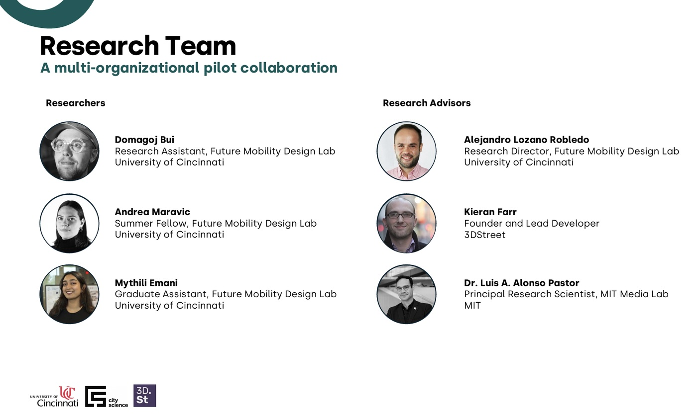

Can augmented reality transform how communities engage with street redesigns? A research collaboration between University of Cincinnati's Future Mobility DesignLab, MIT City Science Lab, and 3DStreet just proved the answer is yes—and created a replicable blueprint for cities worldwide.

<!-- truncate -->

## The Challenge

Communities struggle to imagine proposed street changes, leading to project delays, pushback, and eroded trust between residents and agencies. The UC team, led by Alejandro Lozano Robledo with researchers Mythili Emani, Domagoj Bui, and Andrea, asked two questions:

1. **Is accessible AR technically feasible?** Can we deliver on-site experiences using just smartphones, no apps required?
2. **Does it actually improve engagement?** What happens when communities can walk through future streets before they're built?

After testing at Cincinnati's Short Vine and University Avenue intersection, both answers came back strongly positive.

## Technical Breakthrough: The Right Stack

The team evaluated Adobe Aero, InSitu, WebAR by Onyx, and 8th Wall. **8th Wall won** for three reasons:

- **No app required**: Works entirely in mobile browsers
- **Visual Positioning System (VPS)**: More reliable than GPS-only anchoring
- **Multi-location layering**: Display different content at each intersection corner, enabling progressive storytelling

The scanning process revealed critical lessons: texture-rich surfaces (brick, detailed corners) anchor AR content reliably, while plain concrete fails. Lighting consistency matters—scan at times matching when people will view it. Weather affects both scanning and viewing.

## Storytelling Innovation: Personas Over Data

Instead of floating statistics, the team created diverse character avatars—local business owners, elderly residents, families—each explaining how changes affect their lives. Speech bubbles combined personal stories with real data: "These streetscape improvements didn't just look better—crime dropped 40%."

As Luis Alonso from MIT noted, personas could show current problems, then reappear in the redesigned street celebrating improvements—creating emotional narrative arcs that abstract data cannot.

"When I see the person and their speech bubble, I can't stop myself from reading," said Kieran Farr. "Unlike floating data visualizations, which I ignore."

## The User Experience

Participants scan a QR code (paper prototype, eventually stickers or spray-painted markers), explore the AR scene for 2-3 minutes, walk to different corners to reveal layered information, then complete a survey. Directional markers guide users to optimal viewing positions.

The team documented everything with 360° cameras—while they don't capture AR content, they create immersive training materials for future facilitators.

## Scalability and Next Steps

**Key insight**: The facilitation team doesn't need to be on-site. They can provide scanning protocols remotely, local teams scan the location, then UC creates the 3D content from anywhere. The Short Vine intersection typology—mixed-use urban street with safety concerns—exists in cities globally.

**Pilot 1**: Real community workshops in Cincinnati with transportation agencies including ODOT and regional transit authorities.

**Pilot 2**: Deployment to additional U.S. cities. San Francisco is a leading candidate given existing 3DStreet work there.

**Future**: International comparative studies on AR's impact across cultures and contexts.

The team plans academic publications documenting methodology, impact studies comparing engagement with and without AR tools, and knowledge-sharing across MIT City Science, UC Digital Futures, and 3DStreet platforms.

## Why It Matters

This validates that accessible AR can meaningfully improve transportation planning engagement—without expensive equipment, proprietary software, or specialized expertise. The framework shifts conversations from loss aversion ("you're taking my parking!") to collaborative opportunity ("what should we gain here?").

For 3DStreet users, the workflow is proven: Create scenes in 3DStreet, export as "AR Ready," deploy through 8th Wall or InCitu, then iterate based on community feedback.

As cities face mounting challenges around climate, housing, and equity, democratizing urban design isn't optional—it's essential.

---

*Based on research by University of Cincinnati (Alejandro Lozano Robledo, Mythili Emani, Domagoj Bui, Andrea), MIT City Science Lab (Luis Alonso), and 3DStreet (Kieran Farr). Read more at [UC Digital Futures](https://ucdigitalfutures.com/blueprint-for-civic-co-creation/) and [MIT Media Lab](https://www.media.mit.edu/projects/a-window-into-our-future-community-an-augmented-on-site-experience/).*
